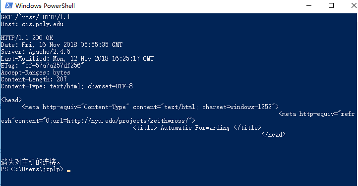

## 第二章 2.2.3节 关于HTTP报文与telnet的小实验

实验环境：windows10

### 实验过程

1. windows10默认关闭telnet服务，首先要去控制面板打开。  
打开方法：https://jingyan.baidu.com/article/ae97a646b22fb6bbfd461d19.html
2. 打开命令行 输入 telnet cis.poly.edu 80  
输入回车后可见控制台窗口，但此时输入字符却无法显示
3. 按 CTRL + ] ，再按一下回车，恢复到控制台窗口。
4. 输入下面内容，并按回车： 
GET /~ross/ HTTP/1.1  
Host: cis.poly.edu  
注意：  
telnet连接时间非常短暂，大概几秒之后就会“遗失对主机的连接”。 
因此建议提前复制好文本，直接点击鼠标右键粘贴即可。

### 实验结果

注意： 
显示状态码为200 OK，并且有ross相关内容时才算成功。
