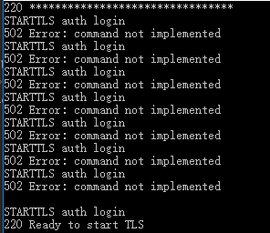
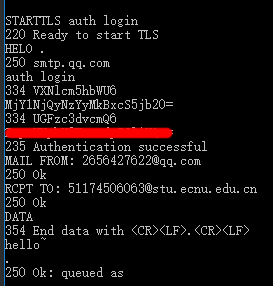
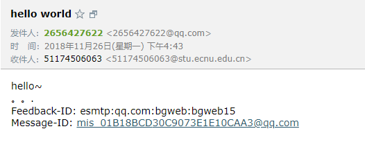

## 第二章 2.4.1节 2.4.3节 关于SMTP报文与telnet的小实验

实验环境：windows10
QQ邮箱

### 实验过程

* windows10默认关闭telnet服务，首先要去控制面板打开。  
打开方法：https://jingyan.baidu.com/article/ae97a646b22fb6bbfd461d19.html
* 打开QQ邮箱的SMTP相关服务，并取得授权码来代替邮箱密码  
方法：https://service.mail.qq.com/cgi-bin/help?subtype=1&&no=1001256&&id=28
* 部分操作需要用到base64编码和解码。网上工具很多，随便找一个即可。
* 打开命令行 输入： 
telnet smtp.qq.com 25  
连接QQ邮箱服务器  
返回： 
220 ********************************
* 命令行 输入： 
STARTTLS auth login  
这是一种加密措施。QQ邮箱服务器限制不加密的话登陆无法成功。 
返回： 
220 Ready to start TLS 
注意服务器可能因为请求过多，所以要输入很多次才可能成功，例如我这样： 
  
可能需要尝试更多次才能成功。
* 命令行 输入： 
HELO .
HELO空格后面任意内容
返回： 
250 smtp.qq.com
* 命令行 输入： 
auth login 
这是登陆命令 
返回： 
334 VXNlcm5hbWU6  
VXNlcm5hbWU6的base64解码后是Username:，提示你输入用户名
* 命令行 输入你的用户名（用base64编码后） 
比如我的2656427622@qq.com是MjY1NjQyNzYyMkBxcS5jb20=
返回： 
334 UGFzc3dvcmQ6 
提示你输入密码
* 命令行 输入你的授权码（用base64编码后） 
如果登陆成功则返回： 
235 Authentication successful
* 然后就可以发送信件了，下面是我的例子： 
如果没有发生错误，返回一般都是： 
250 OK
* 发件人 
MAIL FROM: 2656427622@qq.com 
* 收件人 
RCPT TO: 51174506063@stu.ecnu.edu.cn 
* 提示输入正文 
DATA 
* 正文内容 
注意正文可以输入报文首部，也可以不输入。 
不输入的例子： 
hello~ 
. 
输入的例子： 
From: 2656427622@qq.com 
To: 51174506063@stu.ecnu.edu.cn 
Subject: hello world 
hello~ 
. 
如果回复： 
250 Ok: queued as 
说明已经成功了，正在队列中等待发送。
* 发送完之后 输入QUIT退出telnet

### 实验结果
 
无报文首部的邮件情况： 
 
有报文首部的邮件情况： 
 
