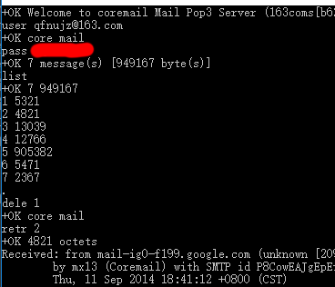

## 第二章 2.4.4节 关于POP3报文与telnet的小实验

实验环境：windows10
163邮箱

注意：由于QQ邮箱110端口需要安全连接才能访问，但是经过实验apop和STARTTLS都不可行，SSL连接又不支持telnet，因此改用163邮箱。

### 实验过程和结果

* windows10默认关闭telnet服务，首先要去控制面板打开。  
打开方法：https://jingyan.baidu.com/article/ae97a646b22fb6bbfd461d19.html

* 打开命令行 输入： 
telnet pop.163.com 110

* 后续操作非常简单，看图即可

