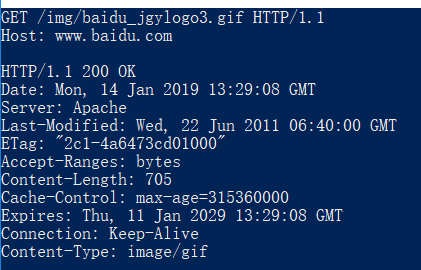
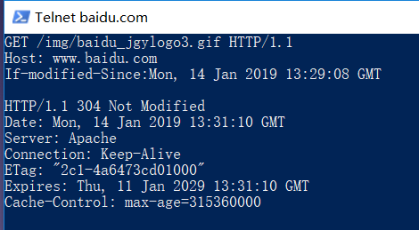

## 第二章 复习题R14  

首先用telnet请求一次内容，确定内容的Last-Modified时间。然后再用一个晚于该时间的时间去询问对象即可。  

* telnet baidu.com 80  
GET /img/baidu_jgylogo3.gif HTTP/1.1  
Host: www.baidu.com  

* telnet baidu.com 80  
GET /img/baidu_jgylogo3.gif HTTP/1.1  
Host: www.baidu.com  
If-modified-Since:Mon, 14 Jan 2019 13:29:08 GMT  

