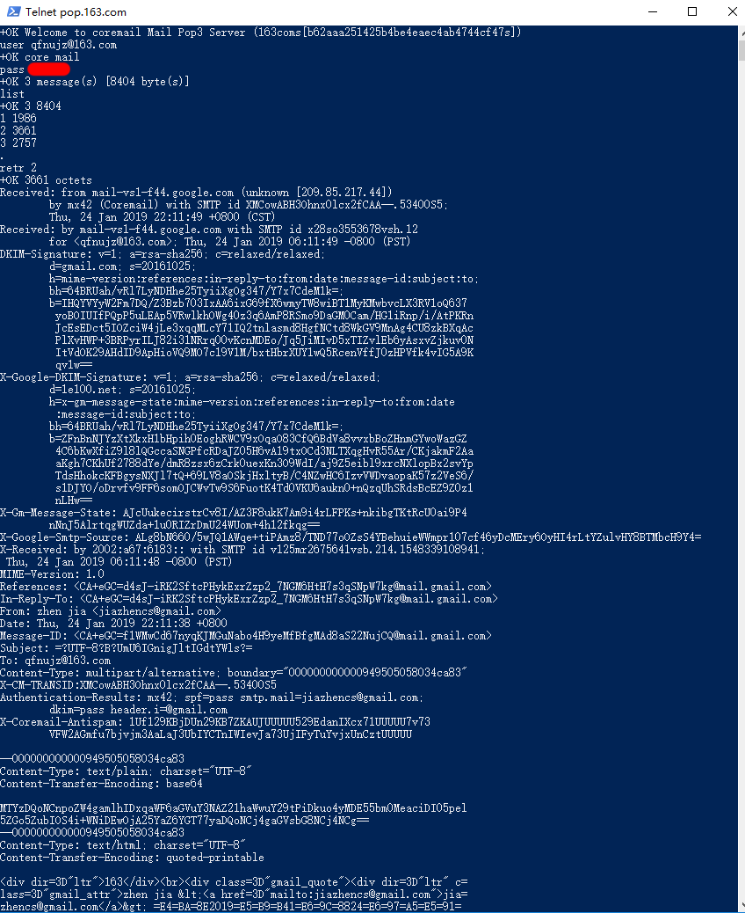

## 第二章 复习题R20  

疑问：发送该该报文的主机，是指的发件人的主机么？  
下面假设要寻找发件人的主机IP地址。    

####  edu邮箱  
由于并没有.edu的电子邮箱，因此采用edu.cn的邮箱来代替。  
结论：可以知道发送该报文的IP地址。

* 打开命令行 输入： 
telnet pop.163.com 110

* 后续操作看图即可  
  
其中首部的X-Originating-IP代表发信人客户端地址(对外发送邮件地址)。  
####  Gmail邮箱  
操作与上面类似。  
  
我没找到IP地址。