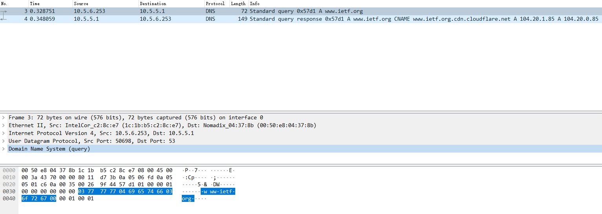
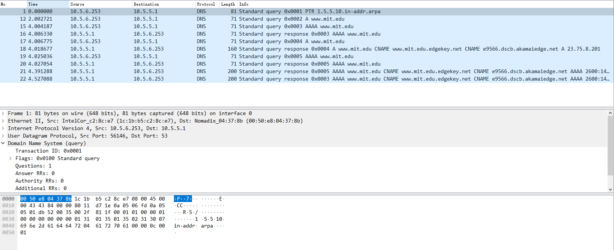
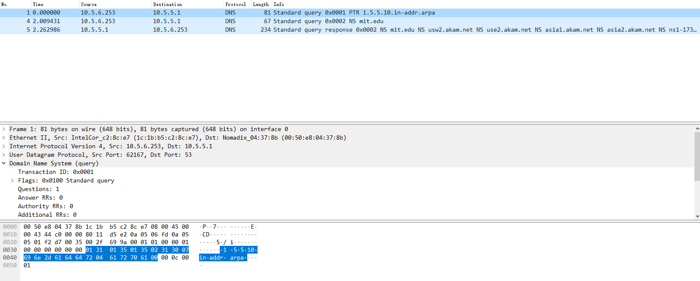
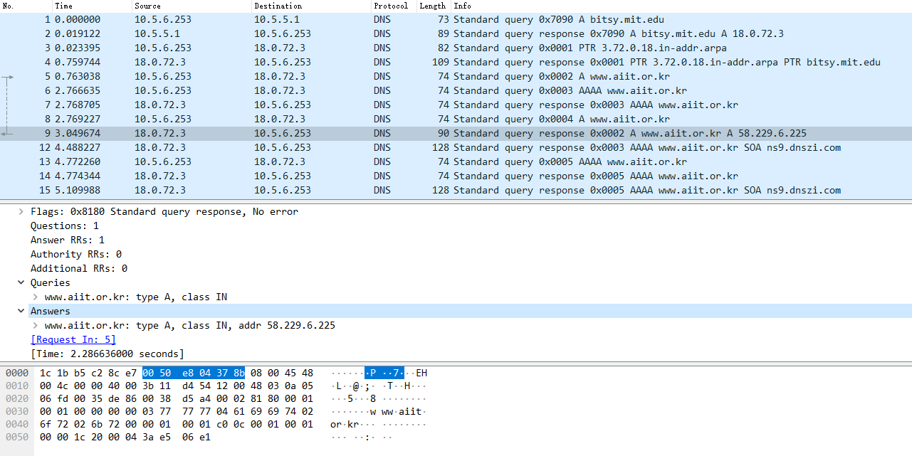

### 1. nslookup

1. 运行nslookup以获取一个亚洲的Web服务器的IP地址。该服务器的IP地址是什么？   
```
nslookup baidu.com

DNS request timed out.
    timeout was 2 seconds.
服务器:  UnKnown
Address:  10.5.5.1

非权威应答:
名称:    baidu.com
Addresses:  220.181.38.148
          39.156.69.79
```

服务器的IP地址是220.181.38.148和39.156.69.79

2. 运行nslookup来确定一个欧洲的大学的权威DNS服务器。
```
nslookup -type=NS ox.ac.uk

DNS request timed out.
    timeout was 2 seconds.
服务器:  UnKnown
Address:  10.5.5.1

非权威应答:
ox.ac.uk        nameserver = auth6.dns.ox.ac.uk
ox.ac.uk        nameserver = ns2.ja.net
ox.ac.uk        nameserver = auth4.dns.ox.ac.uk
ox.ac.uk        nameserver = auth5.dns.ox.ac.uk
ox.ac.uk        nameserver = dns1.ox.ac.uk
ox.ac.uk        nameserver = dns2.ox.ac.uk
ox.ac.uk        nameserver = dns0.ox.ac.uk
```

3. 运行nslookup，使用问题2中一个已获得的DNS服务器，来查询Yahoo!邮箱的邮件服务器。它的IP地址是什么？  
```
nslookup -type=MX yahoo.com dns0.ox.ac.uk
服务器:  auth0.dns.ox.ac.uk
Address:  129.67.1.190

非权威应答:
yahoo.com       MX preference = 1, mail exchanger = mta6.am0.yahoodns.net
yahoo.com       MX preference = 1, mail exchanger = mta5.am0.yahoodns.net
yahoo.com       MX preference = 1, mail exchanger = mta7.am0.yahoodns.net

nslookup mta6.am0.yahoodns.net auth6.dns.ox.ac.uk

服务器:  snark.mythic-beasts.com
Address:  185.24.221.32

非权威应答:
名称:    mta6.am0.yahoodns.net
Addresses:  67.195.204.77
          67.195.228.111
          67.195.228.109
          67.195.228.94
          67.195.228.106
          67.195.204.73
          67.195.228.110
          98.136.96.91
```

它的IP地址如上。（太多了）

### 2. ipconfig

没有题目  

### 3. 使用Wireshark追踪DNS

* 实验图像
  

4. 找到DNS查询和响应消息。它们是否通过UDP或TCP发送？  
通过UDP发送  

5. DNS查询消息的目标端口是什么？ DNS响应消息的源端口是什么？  
端口都是53

6. DNS查询消息发送到哪个IP地址？使用ipconfig来确定本地DNS服务器的IP地址。这两个IP地址是否相同？  
查询消息发送到10.5.5.1   
与本地DNS服务器的IP地址相同  

7. 检查DNS查询消息。DNS查询是什么"Type"的？查询消息是否包含任何"answers"？  
DNS查询是Type A  
查询消息不包含任何"answers"  

8. 检查DNS响应消息。提供了多少个"answers"？这些答案具体包含什么？  
```
Answers
    www.ietf.org: type CNAME, class IN, cname www.ietf.org.cdn.cloudflare.net
    www.ietf.org.cdn.cloudflare.net: type A, class IN, addr 104.20.1.85
    www.ietf.org.cdn.cloudflare.net: type A, class IN, addr 104.20.0.85
```

9. 考虑从您主机发送的后续TCP SYN数据包。 SYN数据包的目的IP地址是否与DNS响应消息中提供的任何IP地址相对应？  
后续TCP SYN数据包与DNS响应消息中提供的104.20.1.85对应  

10. 这个网页包含一些图片。在获取每个图片前，您的主机是否都发出了新的DNS查询？  
并没有发出新的DNS查询  

11. DNS查询消息的目标端口是什么？ DNS响应消息的源端口是什么？  
端口都是53  

12. DNS查询消息的目标IP地址是什么？这是你的默认本地DNS服务器的IP地址吗？  
DNS查询消息的目标IP地址是10.5.5.1，是默认本地DNS服务器的IP地址  

13. 检查DNS查询消息。DNS查询是什么"Type"的？查询消息是否包含任何"answers"？  
Type A  查询消息不包含任何"answers"

14. 检查DNS响应消息。提供了多少个"answers"？这些答案包含什么？  
```
Answers
    www.mit.edu: type CNAME, class IN, cname www.mit.edu.edgekey.net
    www.mit.edu.edgekey.net: type CNAME, class IN, cname e9566.dscb.akamaiedge.net
    e9566.dscb.akamaiedge.net: type A, class IN, addr 23.75.8.201
```

15. 提供屏幕截图。  
实验图像  
  

16. DNS查询消息发送到的IP地址是什么？这是您的默认本地DNS服务器的IP地址吗？  
DNS查询消息的目标IP地址是10.5.5.1，是默认本地DNS服务器的IP地址  

17. 检查DNS查询消息。DNS查询是什么"Type"的？查询消息是否包含任何"answers"？  
Type NS 查询消息不包含任何"answers"  

18. 检查DNS响应消息。响应消息提供的MIT域名服务器是什么？此响应消息还提供了MIT域名服务器的IP地址吗？  
```
mit.edu nameserver = usw2.akam.net
mit.edu nameserver = use2.akam.net
mit.edu nameserver = asia1.akam.net
mit.edu nameserver = asia2.akam.net
mit.edu nameserver = ns1-173.akam.net
mit.edu nameserver = use5.akam.net
mit.edu nameserver = ns1-37.akam.net
mit.edu nameserver = eur5.akam.net
```
响应消息没有提供MIT域名服务器的IP地址  

19. 提供屏幕截图。
实验图像  
  

20. DNS查询消息发送到的IP地址是什么？这是您的默认本地DNS服务器的IP地址吗？如果不是，这个IP地址是什么？  
DNS查询消息先发送到默认本地DNS服务器10.5.5.1，查询bitsy.mit.edu的IP地址，查询消息再发送到IP地址18.0.72.3，是bitsy.mit.edu的IP地址。  

21. 检查DNS查询消息。DNS查询是什么"Type"的？查询消息是否包含任何"answers"？  
Type A 查询消息不包含任何"answers"  

22. 检查DNS响应消息。提供了多少个"answers"？这些答案包含什么？  
```
Answers
    www.aiit.or.kr: type A, class IN, addr 58.229.6.225
```

23. 提供屏幕截图。
实验图像  
  
