* **P1**  
设主机A的telnet会话端口号为x，主机B的telnet会话端口号为y  
a. 源端口号：x，目的端口号：23  
b. 源端口号：y，目的端口号：23  
c. 源端口号：23，目的端口号：x  
d. 源端口号：23，目的端口号：y  
e. 可能相同  
f. 不可能相同  

* **P2**  
服务器到客户A:  
源端口号:80, 目的端口号:26145, 源IP:B, 目的IP:A  
服务器到客户C，会话1:  
源端口号:80, 目的端口号:7532, 源IP:B, 目的IP:C  
服务器到客户C，会话2:  
源端口号:80, 目的端口号:26145, 源IP:B, 目的IP:C  

* **P3**  
01010011+01100110=10111001  
10111001+01110100=00101110  
反码为 11010001  
使用反码对接收方非常方便，只需将所有数据包含校验码加起来，计算和为全1即可。  
如果不是全1则说明出现了差错。  
1比特的差错肯定可以检查出，2比特的差错存在检测不出的情况。  

* **P4**  
a. 00111110  
b. 10111111  
c. 两个字节的最后一位变化: 01011101 01100100  

* **P5**  
接收方不能完全确认没有比特差错，如P4c题目所示，出现多个差错时存在检测不出的情况  

* **P6**  
发送方发送序号0的报文，进入等待ACK0状态。接收方收到，并且回复ACK，进入等待状态1。
回复的ACK受损了。此时发送方重传报文0，接收方收到报文0，认为序号不对，回复NAK。
发送方收到NAK，发送方重传报文0，接收方依然认为序号不对，回复NAK。  
产生死锁。

* **P7**  
因为ACK和确认序号已经可以完整的标识这个分组，而且ACK的缺失会导致重传，因此最终ACK可以确保到达。  

* **P8**  
与rdt2.2的接收方相同  

* **P9**  
数据分组发生篡改时：  
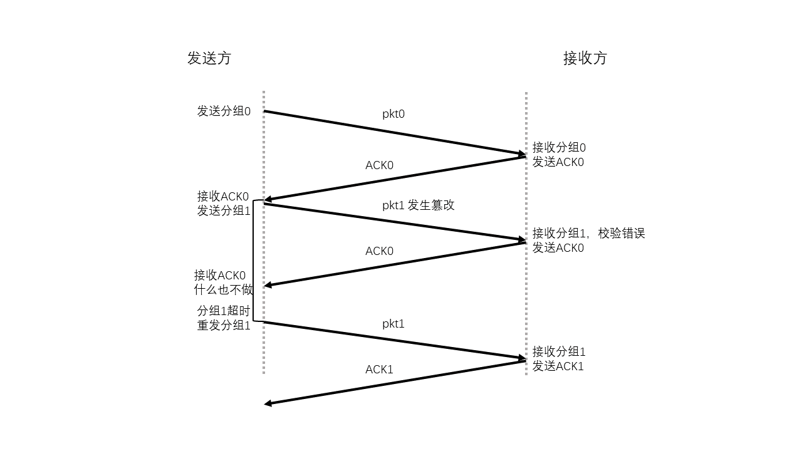  
确认分组发生篡改时：  
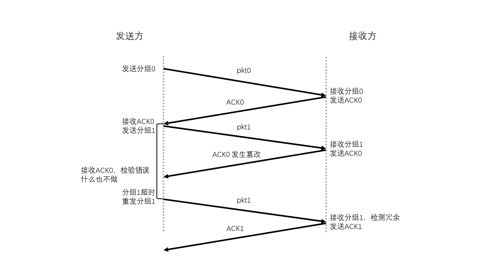  

* **P10**  
如果不使用NAK，则协议正如rdt3.0所示。  
如果使用NAK，则协议如下：  
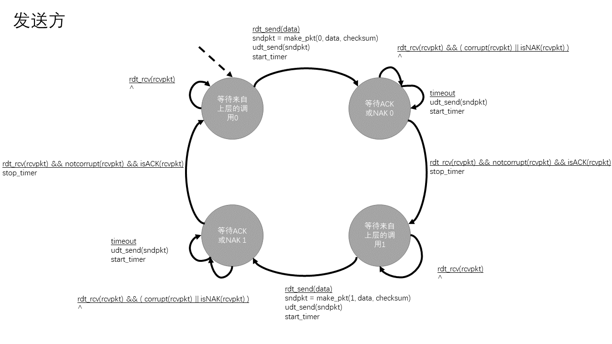  
接收方与rdt2.1接收方相同  

* **P11**  
1. 在等待来自下层的1中删除  
会正常工作。因为上一步状态转换时已经生成了sndpkt  
2. 在等待来自下层的0中删除  
在第一次进入时，会工作不正常。此时sndpkt还没有生成，如果接收了一个校验错误的报文，那么无法返回一个分组。  

* **P12**  
如果定时器正常，那么协议可以正常运行。  
如果定时器过早超时：  
1. 发送1报文。
2. 首先超时，重传1次。
3. 收到ACK报文，发送2报文。
4. 收到上一个ACK报文，重传1次。
5. 超时，重传2次。
6. 收到ACK报文，发送3报文。
7. 收到上一个ACK报文，重传1次。
8. 收到上一个ACK报文，重传2次。
9. 超时，重传3次。
10. 收到ACK报文，发送4报文。  
....  
对于第n个分组，重传n次。  

* **P13**  
无法工作的一个例子：
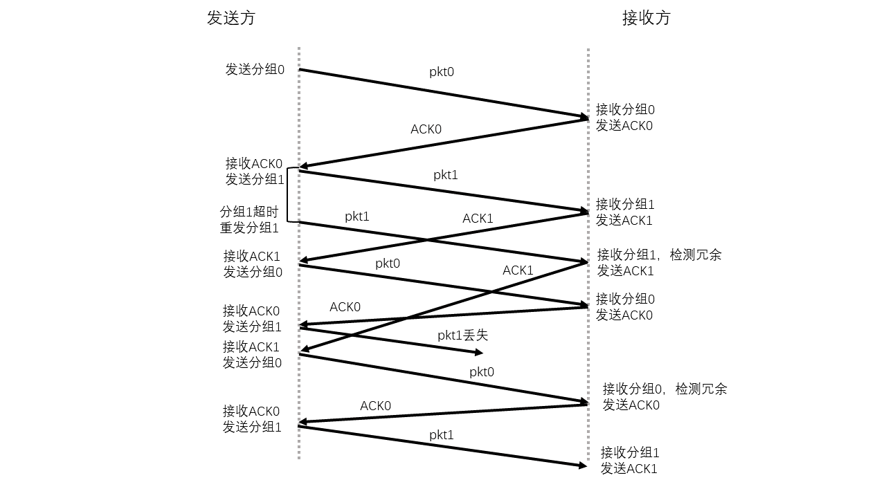  
中间两个报文没有被接收方正确接收就继续发送下面的报文了。  

* **P14**  
1. 不合适。因为发送端如果接收不到数据，无法判定是丢包还是正确接收了。  
2. 不存在丢包的情况下，采用停等协议不适合使用只用NAK的协议。因为发送方必须等待最长的RTT时间，才能确认接收方已经收到。因此相比于ACK协议，时间的花费会更长。  
不存在丢包的情况下，如果采用流水线协议，那么发送方发送的报文如果损坏，接收方无法判断其序号，无法发送NAK报文，发送方会认为这个报文已经正确接收。因此发生错误。  
如果存在少量丢包的情况下，那么只用NAK的协议就更不如使用ACK的协议了  

* **P15**  
L/R = 15 * 8000 / 109 = 0.012  
U = X(L/R) / (RTT + L/R) = 0.9  
X ~= 2251

* **P16**  
可以增加信道利用率，因为发送方接收到大量的ACK，便认为发送的报文已经被正确接收了，然后继续发送后续报文。  
问题：如果发生丢包，损坏等现象，那么接收到的数据是不完整的。

* **P17**  
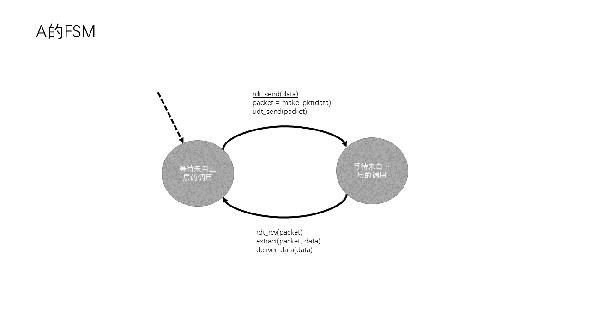   
  

* **P18**  
报文格式:与SR协议相同  
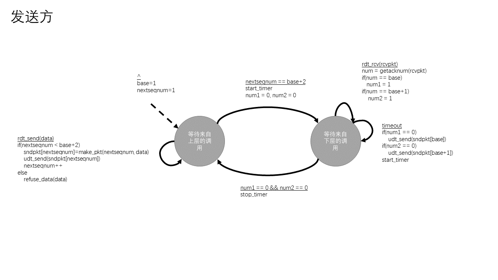   
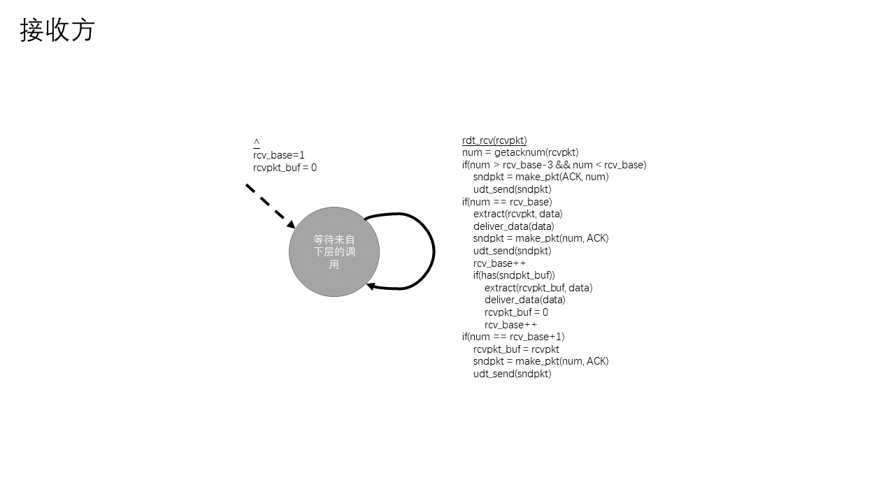  
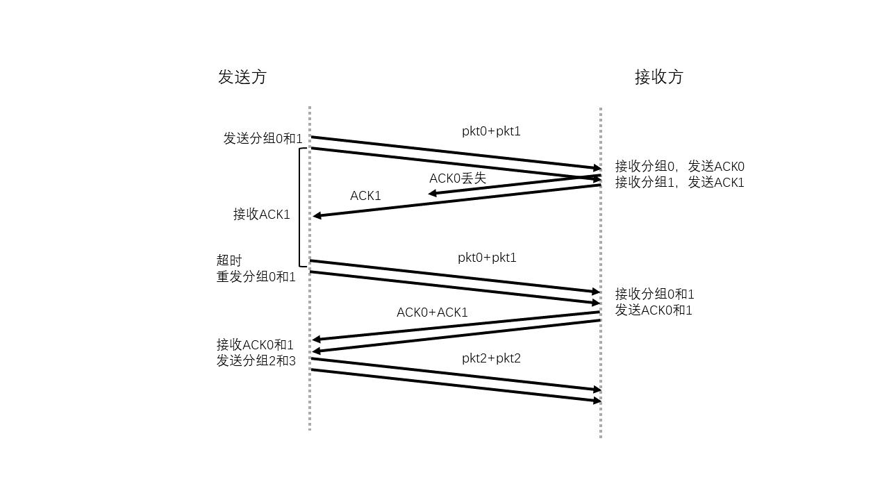  

* **P19**  
报文格式与rdt3.0相比，增加了一个指示ACK报文的来源字段，值为B或C  
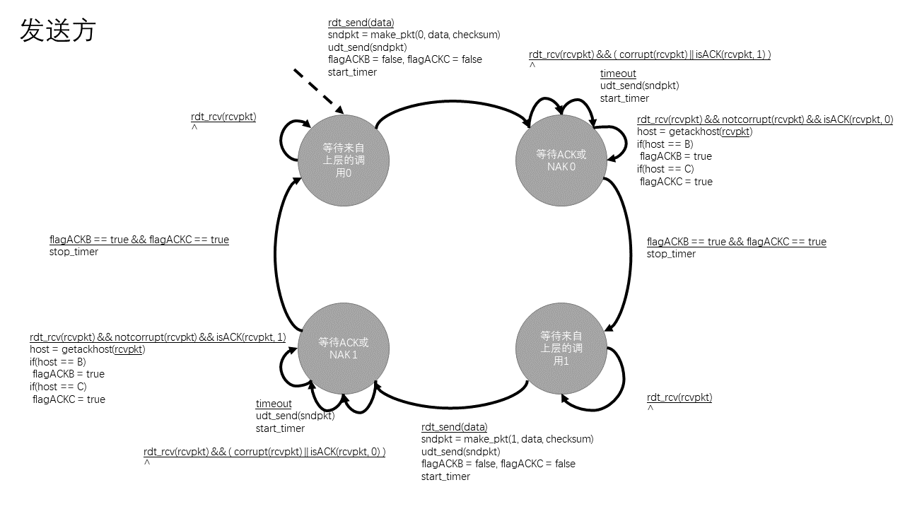   
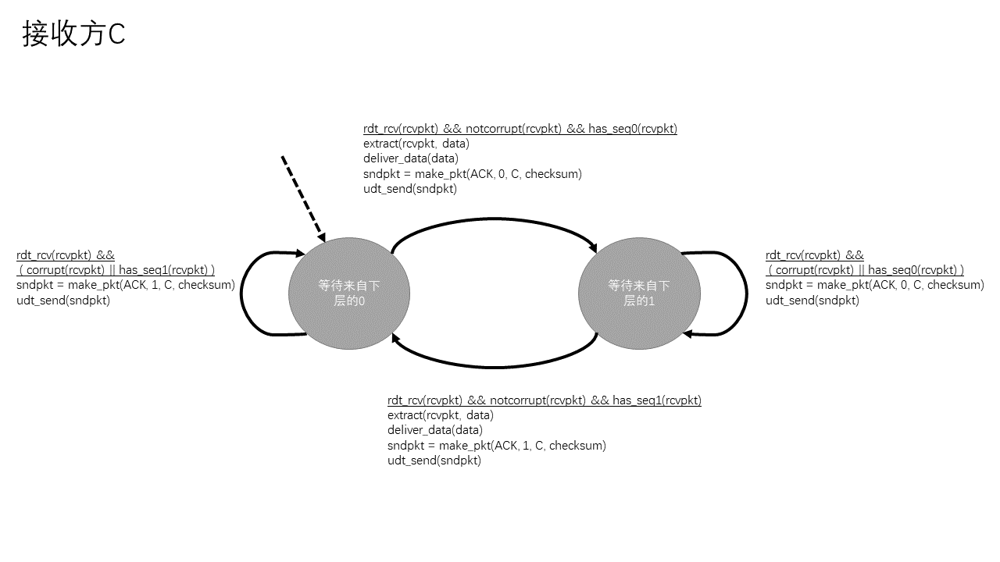   

* **P20**  
报文格式与rdt3.0相比，增加了一个指示数据报文的来源字段，值为A或B  
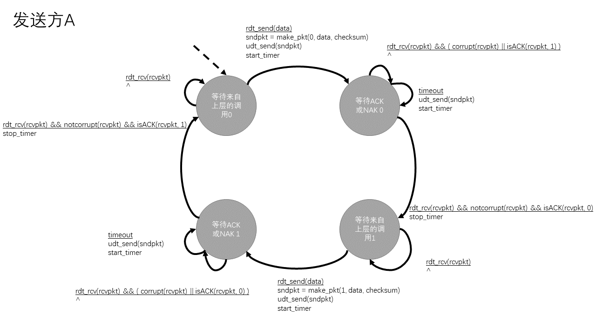   
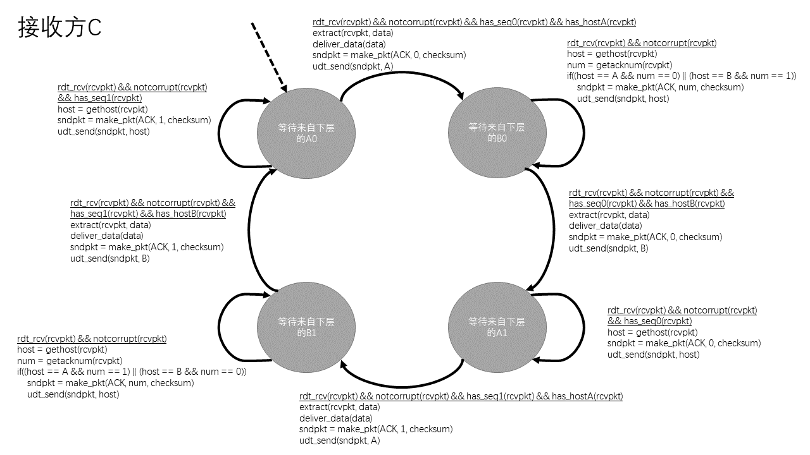   

* **P21**  
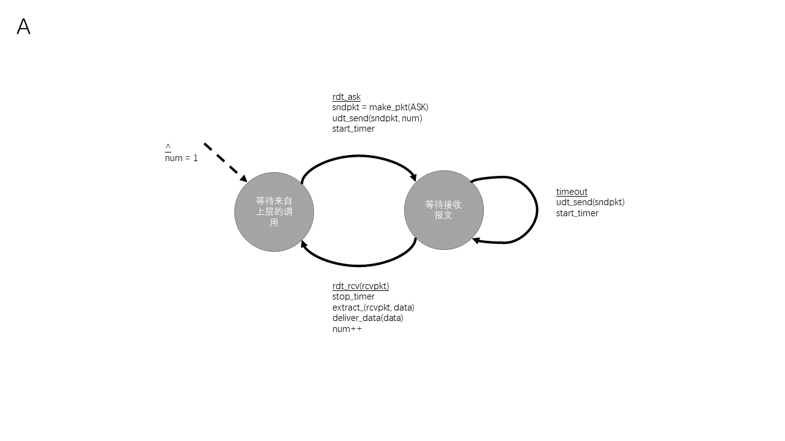   
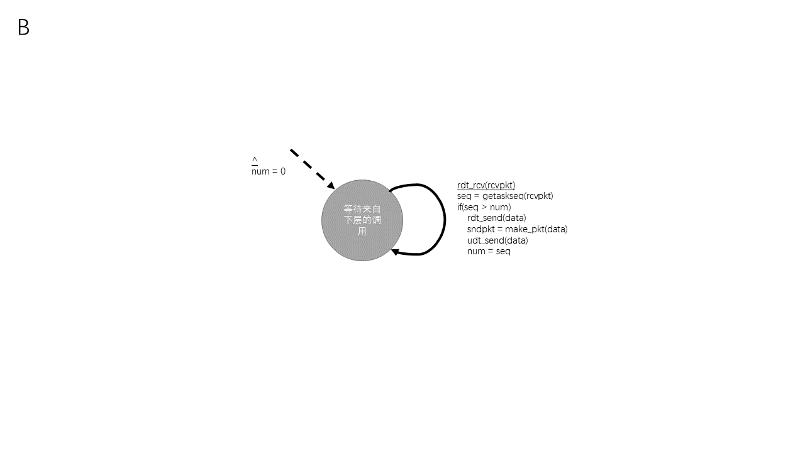   

* **P22**  
a.  
k-4, k-3, k-2, k-1, k, k+1, k+2, k+3  
k-4, k-3, k-2, k-1的极端情况：  
此时发送端发送了k-4, k-3, k-2, k-1的报文，接收方收到，但是ACK报文接收方还没有收到。
k, k+1, k+2, k+3的极端情况：  
发送方发送了k, k+1, k+2, k+3报文，接收方还没有收到。  
b.  
k-5, k-4, k-3, k-2, k-1   
k-4, k-3, k-2, k-1, k的极端情况：  
发送方发送k-5，接收方收到并且返回ACK(k-5)。发送方收到之前就超时，重发k-5。 
发送方收到ACK(k-5)， 发送k-4, k-3, k-2, k-1。  
接收方收到重发k-5，返回ACK(k-5)。收到k-4, k-3, k-2, k-1，返回ACK(k-4)，ACK(k-3)，ACK(k-2)，ACK(k-1)

* **P23**  
如果报文在信道中不会重新排序：  
对于GBN协议，发送方窗口最大为k-1。  
如果窗口为k，就会出现书中图3-27的情况，如果窗口的所有报文的ACK丢失，都被重传，接收方会认为是新报文。  
对于SR协议，发送方窗口最大为k/2。  
如果大于k-2。就会出现书中图3-27的情况，如果窗口的所有报文的ACK丢失，都被重传。接收方会认为是新报文。  

* **P24**  
a. 正确  
假设窗口为0,1，发送方发送0，1后，接收方回复ACK0,1。但是发送方收到ACK0和1之前，就进行了超时重传，发送0，1。  
发送方收到ACK0和1。窗口变为2，3。接收方收到重传的0，1，重新回复ACK0,1。此时发送方收到了ACK0，1，在发送方窗口之外。  
b. 正确  
假设窗口为0,1，发送方发送0，1后，接收方回复ACK0,1。但是发送方收到ACK1之前，就进行了超时重传，发送1。  
发送方收到ACK1。窗口变为2，3。接收方收到重传的1，重新回复ACK1。此时发送方收到了ACK1，在发送方窗口之外。  
c. 正确  
d. 正确  

* **P25**  
a. UDP不会对报文进行分片，而TCP会进行分片。  
b. UDP没有拥塞控制和流量控制，可以自己调整发送速度。  

* **P26**  
a. 如果序号不重复利用，最多232字节。但是TCP的序号是可以重复利用的。  
b. 
报文数 232 / 536 ~= 8,012,999  
(232 + 66 * 8,012,999) * 8  / 155 * 10242 ~= 237s  

* **P27**  
a. 序号 207 源端口号 302 目的端口号 80  
b. 确认号 207 源端口号 80 目的端口号 302  
c. 确认号 247  
d.  
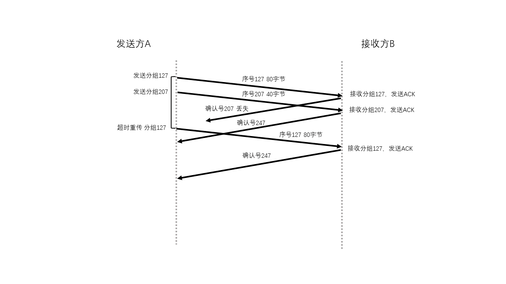   

* **P28**  
发送方维护一个接收窗口来实现流量控制，接收方提供给发送方指示接收方缓存还有多少可用空间。  
在实际的运行中，一开始接收方缓存为空，接收窗口很大。发送方发送许多数据。但是接收方读取速度较慢，因此缓存逐渐变满，接收窗口越来越小。  
发送方的速率逐渐下降，最后与接收方读取数据的速率相同。  

* **P29**  
a. 因为使用这种特殊的序号使得服务器不用记忆初始序号，不用为连接保存状态信息。  
b. 如果攻击者不知道生成cookie的函数，那么就不能成功创建一个全开或者半开连接。  
c. 是可以使得服务器产生全开连接的。  

* **P30**  
a. 当初始数据被发送到套接字的速率大时，时延高会导致丢包率过大，从而减小吞吐量。  
如果路由器缓存长度增加，速度不变，那么报文在路由器缓存中的时间边长，如果时间超过固定的超时值，那么路由器就会转发不必要的分组副本，从而降低吞吐量。  
b. 路由器缓存更多的报文，可以出现更少的丢包情况，有助于增加吞吐量。   

* **P31**  
我认为书上翻译错误，应该是给出了5个样本之前的初值。  

|  | 初值 | 1 | 2 | 3 | 4 | 5 |
:---: | :---: | :---: | :---: | :---: | :---: | :---: 
SampleRTT | / | 106 | 120 | 140 | 90 | 115 | 
EstimatedRTT | 100 | 100.75 | 103.16 | 107.77 | 105.55 | 106.73 | 
DevRTT | 5 | 5.06 | 8.00 | 14.06 | 14.43 | 12.89 | 
TimeoutInterval | 120 | 120.99 | 135.16 | 164.01 | 163.27 | 158.29 | 

* **P32**  
a.  
EstimatedRTT1 = 0.9 * EstimatedRTT0 + 0.1 * SampleRTT1  
EstimatedRTT2 = 0.92 * EstimatedRTT0 + 0.1 * 0.9 * SampleRTT1 + 0.1 * SampleRTT2  
EstimatedRTT3 = 0.93 * EstimatedRTT0 + 0.1 * 0.92 * SampleRTT1 + 0.1 * 0.9 * SampleRTT2 + 0.1 * SampleRTT3  
EstimatedRTT4 = 0.94 * EstimatedRTT0 + 0.1 * 0.93 * SampleRTT1 + 0.1 * 0.92 * SampleRTT2 + 0.1 * 0.9 * SampleRTT3 + 0.1 * SampleRTT4  
b.  
$$ \[{\rm{EstimatedR}}{{\rm{T}}_{{\rm{Tn}}}} = {0.9^n}{\rm{EstimatedR}}{{\rm{T}}_{{\rm{T0}}}} + 0.1\sum\limits_{i = 1}^n {{\rm{0}}{\rm{.}}{{\rm{9}}^{\left( {n - i} \right)}}{\rm{EstimatedR}}{{\rm{T}}_{{\rm{Ti}}}}} \] $$  
c. 

* **P33**  