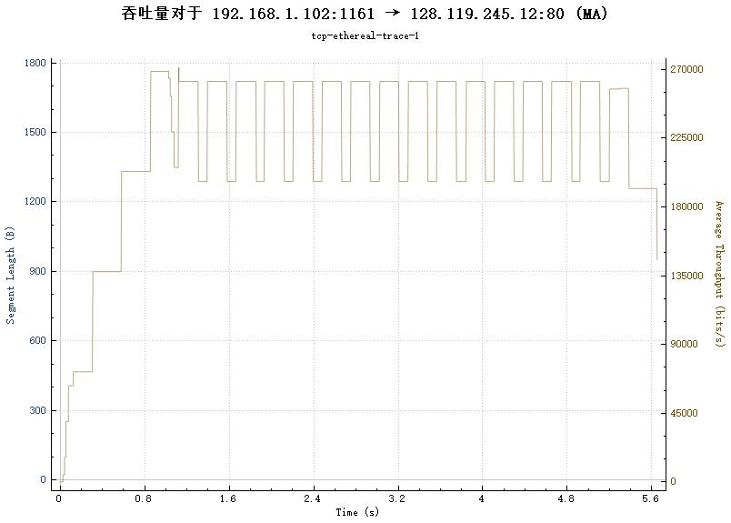
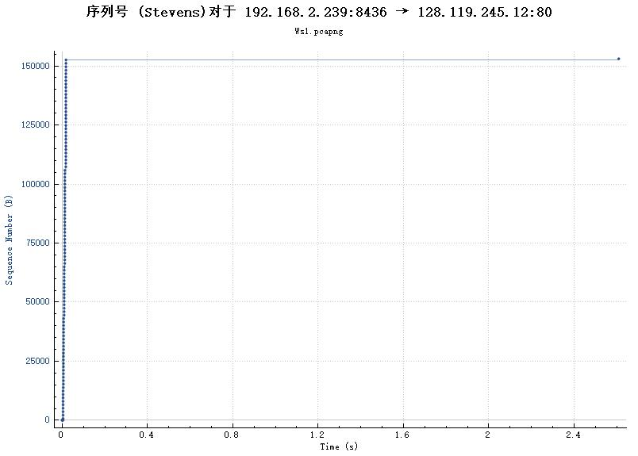

### 1.捕获从计算机到远程服务器的批量TCP传输

* 实验图像

下面题目中如没有特别指明，就根据要求使用下载的Wireshark捕获的数据包文件tcp-ethereal-trace-1  

### 2.初步了解捕获的轨迹  

1. 源IP地址为 192.168.1.102 TCP源端口号为1161  

2. gaia.cs.umass.edu 的IP地址是128.119.245.12，在端口号80上发送和接收此连接。

3. 客户端使用的IP地址为 192.168.2.239 ，端口号为8436  

### 3.TCP基础 

4. 序列号Seq = 0。SYN报文负责建立连接，选择客户端初始的序列号  

5. 序列号Seq = 0。 Acknowledgment栏位的值是1。将SYN中的Seq值加1。确认客户端的连接，选择服务器端初始的序列号  

6. 序列号Seq = 1。

7. 前六个TCP报文的具体信息：  

| 计数 | 序列号 | 发送时间 | ACK时间 | RTT值 | EstimatedRTT值 |
:---: | :---: | :---: | :---: | :---: | :---: 
| 1 | 1 | 0.026477 | 0.053937 | 0.02746‬ | 0.02746 | 
| 2 | 566 | 0.041737 | 0.077294 | 0.035557‬ | 0.028472125 | 
| 3| 2026 | 0.054026 | 0.124085 | 0.070059‬‬ | 0.033670484375 |
| 4 | 3486 | 0.054690 | 0.169118 | 0.114428‬‬ | 0.043765173828125 |
| 5 | 4946 | 0.077405 | 0.217299 | 0.139894‬‬ | 0.05578127709960937 |
| 6 | 6406 | 0.078157 | 0.267802 | 0.189645‬‬ | 0.07251424246215821 |

8. 前6个TCP报文的长度分别为：565，1460，1460，1460，1460，1460  

9. 接收窗口最小为5840。缺少接收窗口会限制发送方发送TCP报文，但包中实际的接收窗口远大于发送的报文数量，因此不会限制  

10. 使用ip.src==192.168.1.102查看客户端发出的所有报文，发现序列号一直在增加，因此没有重传报文。  

11. 观察了一些报文，发现是接收方收到一个报文即发送一个ACK，没有报多个确认合并。  

12. WireShark输出的吞吐量折线：  
  
吞吐量的实际计算：每秒收到的字节数  

### 4.TCP拥塞控制  

13. 从图中我看不出来，感觉好像0-0.3s像是慢启动阶段，后面是拥塞避免阶段，但是又不太像。

14. 我自己捕获的报文的时序图
  
从这个图中，更看不出来了。

