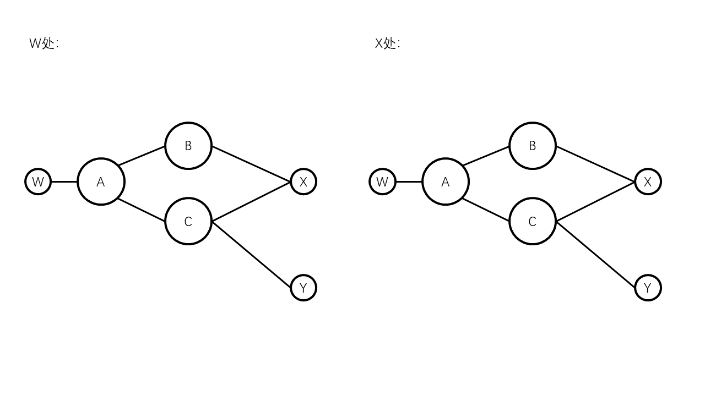
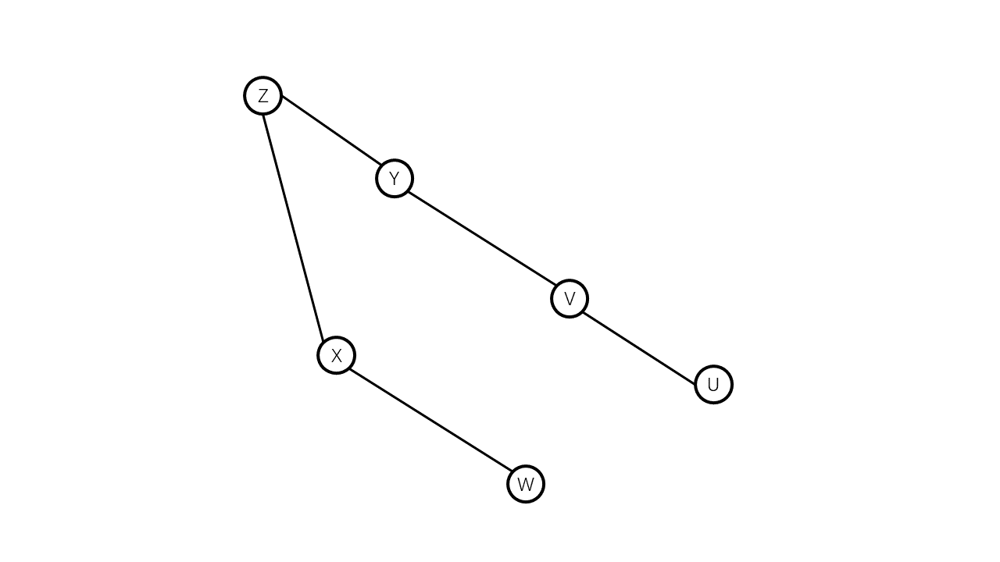
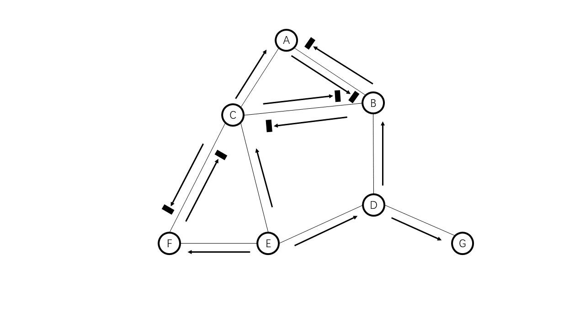
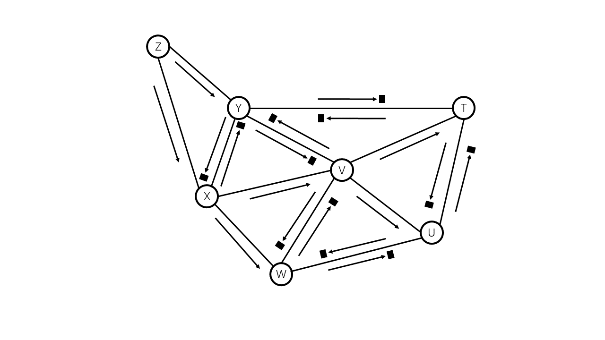
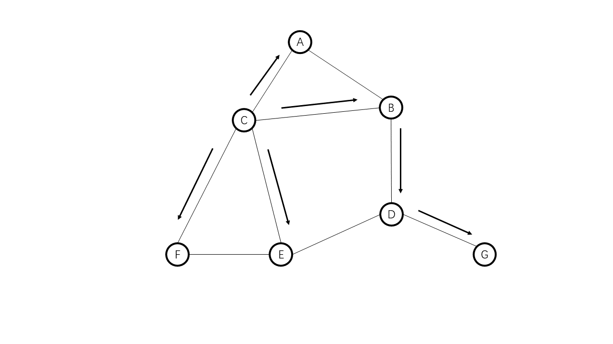
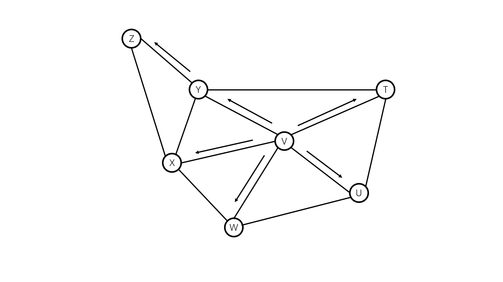

* **P1**  
a. 数据报网络更好，如果无法运转时可以使用其他的路线继续发送。如果是虚电路就需要重新建立连接了。  
b. 虚电路体系更好，因为提供固定的容量正好能搭建一个虚电路。  
c. 数据报体系的控制流量开销更多，因为数据报需要更大报文首部。  

* **P2**  
a. 256个  
b. 可能的确定方法：有一个虚电路表，记录当前已经使用的VC号，中心结点设定一个未被使用的VC号。这样设置就不会出现比确定的最大值少的情况。  
c. 链路只需要向它的下一跳协商，VC号不与当前结点和下一跳结点中的其它VC号重复即可。  

* **P3**  
虚电路网络：  
入接口，入VC号，出接口，出VC号  
数据报网络：  
目的子网，出接口  

* **P4**  
a.  

| 目的地址 | 出接口 |
:---: | :---: 
| H1 | 1 | 
| H2 | 2 | 
| H3 | 3 | 

b. 修改转发表的格式：  

| 入接口 | 目的地址 | 出接口 |
:---: | :---: | :---: 
| 1 | H2 | 2 | 
| 2 | H1 | 1 | 
| 1 | H3 | 3 | 
| 2 | H3 | 4 | 

c.  
设H1-H3各段的VC号为 01 02 03 04  
设H2-H3各段的VC号为 05 06 07 08 

| 入接口 | 入VC号 | 出接口 | 出VC号 |
:---: | :---: | :---: | :---: 
| 1 | 01 | 3 | 02 | 
| 2 | 05 | 4 | 06 | 

d.  
路由器B:  

| 入接口 | 入VC号 | 出接口 | 出VC号 |
:---: | :---: | :---: | :---: 
| 1 | 02 | 2 | 03 | 

路由器C:  

| 入接口 | 入VC号 | 出接口 | 出VC号 |
:---: | :---: | :---: | :---: 
| 1 | 06 | 2 | 07 | 

路由器D:  

| 入接口 | 入VC号 | 出接口 | 出VC号 |
:---: | :---: | :---: | :---: 
| 1 | 03 | 3 | 04 | 
| 2 | 07 | 3 | 08 | 

* **P5**  
a. VC号分别为 00，01，10，11  
b. 24种不同的组合  

* **P6**  
网络层提供了主机之间的连接服务，运输层则使用这个服务建立进程间的连接。  

* **P7**  
a. 不能  
b. 可以  
c. 不能  

* **P8**  
内存(单处理器)： （n-1）D  
共享总线： （n-1）D  
纵横式总线： （n-1）D  

* **P9**  
最好方法：2个时隙  

| 时间 | 入端口号 | 端口号 |
:---: | :---: | :---:
| 1 | 1 | X |  
| 1 | 2 | Y |  
| 1 | 3 | Z |  
| 2 | 2 | X |  
| 2 | 3 | Y |  

最差方法：3个时隙  

| 时间 | 入端口号 | 端口号 |
:---: | :---: | :---:
| 1 | 1 | X |  
| 1 | 3 | Y |  
| 2 | 2 | Y |  
| 2 | 3 | Z |  
| 3 | 2 | X |  

* **P10**  
a. 

| 目的子网 | 出接口 |
:---: | :---: 
| 224.0.0.0/22 | 0 | 
| 224.64.0.0/16 | 1 | 
| 224.64.0.0/22 | 2 | 
| 其它 | 3 | 

b. 3, 1, 3   

* **P11**  
0/6, 26个  
64/5, 25个  
96/5, 25个  
128/6, 26个  
160/6, 26个  

* **P12**  
0/7, 27个  
128/6, 26个  
244/5, 25个  
96/5, 25个  

* **P13**  
子网2： 223.1.17.0/25  
子网1： 223.1.17.128/26  
子网3： 223.1.17.192/26  

* **P14**  

| 目的子网 | 出接口 |
:---: | :---: 
| 200.23.16.0/11 | 0 | 
| 200.23.24.0/8 | 1 | 
| 200.23.24.0/11 | 2 | 
| 其他 | 3 | 

* **P15**  
已经使用a.b.c.d/x记法。  

* **P16**  
IP地址例子: 128.119.40.129  
四个子网：  
128.119.40.128/5  
128.119.40.160/5  
128.119.40.192/5  
128.119.40.224/5  

* **P17**  
a.  
A: 214.97.254.0/24 去掉 214.97.254.0/30   
B: 214.97.255.0/25 去掉 214.97.255.0/30   
C: 214.97.255.128/25 去掉 214.97.255.128/30    
D: 214.97.254.0/30  
E: 214.97.255.0/30  
F: 214.97.255.128/30  

b.  
路由器R1  

| 目的子网 | 出接口 |
:---: | :---: 
| 214.97.254.0/24 | 1 | 
| 214.97.255.0/25 | 2 | 
| 214.97.255.128/25 | 3 | 
| 214.97.254.0/30 | 2 | 
| 214.97.255.0/30 | ? | 
| 214.97.255.128/30 | 3 | 

路由器R2  

| 目的子网 | 出接口 |
:---: | :---: 
| 214.97.254.0/24 | 1 | 
| 214.97.255.0/25 | 3 | 
| 214.97.255.128/25 | 2 | 
| 214.97.254.0/30 | ? | 
| 214.97.255.0/30 | 2 | 
| 214.97.255.128/30 | 1 | 

路由器R3  

| 目的子网 | 出接口 |
:---: | :---: 
| 214.97.254.0/24 | 1 | 
| 214.97.255.0/25 | 2 | 
| 214.97.255.128/25 | 3 | 
| 214.97.254.0/30 | 1 | 
| 214.97.255.0/30 | 3 | 
| 214.97.255.128/30 | ? | 

* **P18**  
中国的大学被设置禁止查询。  
whois服务不能被用来查询确定的地理位置，但是可以看到注册所在的地区。  
例如taobao.com  地区：浙江省杭州市   

* **P19**  
700字节的MTU，承载的传输层数据为680字节，因此生成4个分片。  
第一个分片： 标识号：422, 偏移：0, 标志：1  
第二个分片： 标识号：422, 偏移：82, 标志：1  
第三个分片： 标识号：422, 偏移：164, 标志：1  
第四个分片： 标识号：422, 偏移：246, 标志：0  

* **P20**  
1500字节的MTU，承载的应用层数据为1460字节  
5MB为5242880字节，因此需要3592个数据报。  

* **P21**  
a.  
主机1： 192.168.0.1  
主机2： 192.168.0.2  
主机3： 192.168.0.3  
路由器家庭网络端口： 192.168.0.4  

b. NAT转换表  

| WAN端 | LAN端 | 
:---: | :---: 
| 24.34.112.235, 10001 | 192.168.0.1, 12345 | 
| 24.34.112.235, 10001 | 192.168.0.1, 1234 | 
| 24.34.112.235, 10002 | 192.168.0.2, 2345 | 
| 24.34.112.235, 10002 | 192.168.0.2, 2375 | 
| 24.34.112.235, 10003 | 192.168.0.2, 3345 | 
| 24.34.112.235, 10003 | 192.168.0.2, 3845 | 

* **P22**  
可以来检测不同主机的数量。  
检测IP分组的标识号。最开始遇到分组标识号时，记录下来，识别为一个主机。  
后面遇到标识号如果是记录中某标识号的顺序后继，则更新记录中的标识号。  
如果不是，则识别一个新主机，添加进记录中。  

b. 无法工作，因为分不清是新主机还是同一主机的不同报文。  

* **P23**  
因为两方都处在NAT后面，只能主动发起连接，不能当作服务器去接收连接，因为NAT表中没有对应项。  
即使查找某一方已经连接的主机中，让其与该主机发起连接，但是也无法直接转换为两方都是NAT后的对等方连接。  

* **P24**  
y v u, y t u 等等。。

* **P25**  
x-y-z等  
z-y-x-u等  
z-w等  

* **P26**  

| 步骤 | N' | D(y), p(y) | D(z), p(z) | D(v), p(v) | D(u), p(u) | D(w), p(w) | D(t), p(t) | 
:---: | :---: | :---: | :---: | :---: | :---: | :---: | :---: 
| 0 | x | 6,x | 8,x | 3,x | ∞ | 6,x | ∞ | 
| 1 | xv | 6,x | 8,x |  | 6,v | 6,x | 7,v | 
| 2 | xvy |  | 8,x |  | 6,v | 6,x | 7,v | 
| 3 | xvyu |  | 8,x |  |  | 6,x | 7,v | 
| 4 | xvyuw |  | 8,x |  |  |  | 7,v | 
| 5 | xvyuwt |  | 8,x |  |  |  |  | 
| 6 | xvyuwtz |  |  |  |  |  |  | 

x-v  
x-y  
x-z  
x-w  
x-v-t  
x-v-u  

* **P27**  
a.  

| 步骤 | N' | D(y), p(y) | D(z), p(z) | D(v), p(v) | D(u), p(u) | D(w), p(w) | D(x), p(x) | 
:---: | :---: | :---: | :---: | :---: | :---: | :---: | :---: 
| 0 | t | 7,t | ∞ | 4,t | 2,t | ∞ | ∞ | 
| 1 | tu | 7,t | ∞ | 4,t |  | 5,u | ∞ | 
| 2 | tuv | 7,t | ∞ |  |  | 5,u | 7,v | 
| 3 | tuvw | 7,t | ∞ |  |  |  | 7,v | 
| 4 | tuvwy |  | 19,y |  |  |  | 7,v | 
| 5 | tuvwyx |  | 15,x |  |  |  |  | 
| 6 | tuvwyxz |  |  |  |  |  |  | 

t-y  
t-v  
t-u  
t-u-w  
t-v-x  
t-v-x-z  

b.  

| 步骤 | N' | D(y), p(y) | D(z), p(z) | D(v), p(v) | D(t), p(t) | D(w), p(w) | D(x), p(x) | 
:---: | :---: | :---: | :---: | :---: | :---: | :---: | :---: 
| 0 | u | ∞ | ∞ | 3,u | 2,u | 3,u | ∞ | 
| 1 | ut | 9,t | ∞ | 3,u |  | 3,u | ∞ | 
| 2 | utv | 9,t | ∞ |  |  | 3,u | 6,v | 
| 3 | utvw | 9,t | ∞ |  |  |  | 6,v | 
| 4 | utvwx | 9,t | 14,x |  |  |  |  | 
| 5 | utvwxy |  | 14,x |  |  |  |  | 
| 6 | utvwxyz |  |  |  |  |  |  | 

u-v  
u-t  
u-w  
u-v-x  
u-t-y  
u-v-x-z  

c.  

| 步骤 | N' | D(y), p(y) | D(z), p(z) | D(u), p(u) | D(t), p(t) | D(w), p(w) | D(x), p(x) | 
:---: | :---: | :---: | :---: | :---: | :---: | :---: | :---: 
| 0 | v | 8,v | ∞ | 3,v | 4,v | 4,v | 3,v | 
| 1 | vu | 8,v | ∞ |  | 4,v | 4,v | 3,v | 
| 2 | vux | 8,v | 11,x |  | 4,v | 4,v |  | 
| 3 | vuxt | 8,v | 11,x |  |  | 4,v |  | 
| 4 | vuxtw | 8,v | 11,x |  |  |  |  | 
| 5 | vuxtwy |  | 11,x |  |  |  |  | 
| 6 | vuxtwyz |  |  |  |  |  |  | 

v-u  
v-t  
v-w  
v-x  
v-y  
v-x-z  

d.  

| 步骤 | N' | D(y), p(y) | D(z), p(z) | D(u), p(u) | D(t), p(t) | D(v), p(v) | D(x), p(x) | 
:---: | :---: | :---: | :---: | :---: | :---: | :---: | :---: 
| 0 | w | ∞ | ∞ | 3,w | ∞ | 4,w | 6,w | 
| 1 | wu | ∞ | ∞ |  | 5,u | 4,w | 6,w | 
| 2 | wuv | 12,v | ∞ |  | 5,u |  | 6,w | 
| 3 | wuvt | 12,v | ∞ |  |  |  | 6,w | 
| 4 | wuvtx | 12,v | 14,x |  |  |  |  | 
| 5 | wuvtxy |  | 14,x |  |  |  |  | 
| 6 | wuvtxyz |  |  |  |  |  |  | 

w-u  
w-v  
w-x  
w-u-t  
w-v-y  
w-x-z  

e.  

| 步骤 | N' | D(w), p(w) | D(z), p(z) | D(u), p(u) | D(t), p(t) | D(v), p(v) | D(x), p(x) | 
:---: | :---: | :---: | :---: | :---: | :---: | :---: | :---: 
| 0 | y | ∞ | 12,y | ∞ | 7,y | 8,y | 6,y | 
| 1 | yx | 12,x | 12,y | ∞ | 7,y | 8,y |  | 
| 2 | yxt | 12,x | 12,y | 9,t |  | 8,y |  | 
| 3 | yxtv | 12,x | 12,y | 9,t |  |  |  | 
| 4 | yxtvu | 12,x | 12,y |  |  |  |  | 
| 5 | yxtvuw |  | 12,y |  |  |  |  | 
| 6 | yxtvuwz |  |  |  |  |  |  | 

y-z  
y-u  
y-t  
y-v  
y-x  
y-t-u  
y-x-w  

f.  

| 步骤 | N' | D(w), p(w) | D(y), p(y) | D(u), p(u) | D(t), p(t) | D(v), p(v) | D(x), p(x) | 
:---: | :---: | :---: | :---: | :---: | :---: | :---: | :---: 
| 0 | z | ∞ | 12,z | ∞ | ∞ | ∞ | 8,z | 
| 1 | zx | 14,x | 12,z | ∞ | ∞ | 11,x |  | 
| 2 | zxv | 14,x | 12,z | 14,v | 15,v |  |  | 
| 3 | zxvt | 14,x |  | 14,v | 15,v |  |  | 
| 4 | zxvtw |  |  | 14,v | 15,v |  |  | 
| 5 | zxvtwu |  |  |  | 15,v |  |  | 
| 6 | zxvtwut |  |  |  |  |  |  | 

z-x  
z-y  
z-x-w  
z-x-v  
z-x-v-u  
z-x-v-t  

* **P28**  

0. 初始表   
结点u的表：  

| 从/到 | u | v | x | y | z | 
:---: | :---: | :---: | :---: | :---: | :---: 
| u | 0 | 1 | ∞ | 2 | ∞ | 
| v | ∞ | ∞ | ∞ | ∞ | ∞ | 
| y | ∞ | ∞ | ∞ | ∞ | ∞ | 

结点v的表：  

| 从/到 | u | v | x | y | z | 
:---: | :---: | :---: | :---: | :---: | :---: 
| u | ∞ | ∞ | ∞ | ∞ | ∞ | 
| v | 1 | 0 | 3 | ∞ | 6 | 
| x | ∞ | ∞ | ∞ | ∞ | ∞ | 
| z | ∞ | ∞ | ∞ | ∞ | ∞ | 

结点x的表：  

| 从/到 | u | v | x | y | z | 
:---: | :---: | :---: | :---: | :---: | :---: 
| v | ∞ | ∞ | ∞ | ∞ | ∞ | 
| x | ∞ | 3 | 0 | 3 | 2 | 
| y | ∞ | ∞ | ∞ | ∞ | ∞ | 
| z | ∞ | ∞ | ∞ | ∞ | ∞ | 

结点y的表：  

| 从/到 | u | v | x | y | z | 
:---: | :---: | :---: | :---: | :---: | :---: 
| v | ∞ | ∞ | ∞ | ∞ | ∞ | 
| x | ∞ | ∞ | ∞ | ∞ | ∞ | 
| y | 2 | ∞ | 3 | 0 | ∞ | 

结点z的表：  

| 从/到 | u | v | x | y | z | 
:---: | :---: | :---: | :---: | :---: | :---: 
| v | ∞ | ∞ | ∞ | ∞ | ∞ | 
| x | ∞ | ∞ | ∞ | ∞ | ∞ | 
| z | ∞ | 6 | 2 | ∞ | 0 | 

1. 第1次迭代   
结点u的表：（变化）  

| 从/到 | u | v | x | y | z | 
:---: | :---: | :---: | :---: | :---: | :---: 
| u | 0 | 1 | 4 | 2 | 7 | 
| v | 1 | 0 | 3 | ∞ | 6 | 
| y | 2 | ∞ | 3 | 0 | ∞ | 

结点v的表：（变化）  

| 从/到 | u | v | x | y | z | 
:---: | :---: | :---: | :---: | :---: | :---: 
| u | 0 | 1 | ∞ | 2 | ∞ | 
| v | 1 | 0 | 3 | 3 | 5 | 
| x | ∞ | 3 | 0 | 3 | 2 | 
| z | ∞ | 6 | 2 | ∞ | 0 | 

结点x的表：（变化）  

| 从/到 | u | v | x | y | z | 
:---: | :---: | :---: | :---: | :---: | :---: 
| v | 1 | 0 | 3 | ∞ | 6 | 
| x | 4 | 3 | 0 | 3 | 2 | 
| y | 2 | ∞ | 3 | 0 | ∞ | 
| z | ∞ | 6 | 2 | ∞ | 0 | 

结点y的表：（变化）  

| 从/到 | u | v | x | y | z | 
:---: | :---: | :---: | :---: | :---: | :---: 
| u | 0 | 1 | ∞ | 2 | ∞ | 
| x | ∞ | 3 | 0 | 3 | 2 | 
| y | 2 | 3 | 3 | 0 | 5 | 

结点z的表：（变化）  

| 从/到 | u | v | x | y | z | 
:---: | :---: | :---: | :---: | :---: | :---: 
| v | 1 | 0 | 3 | ∞ | 6 | 
| x | ∞ | 3 | 0 | 3 | 2 | 
| z | 7 | 5 | 2 | 5 | 0 | 

2. 第2次迭代   
结点u的表：（变化）  

| 从/到 | u | v | x | y | z | 
:---: | :---: | :---: | :---: | :---: | :---: 
| u | 0 | 1 | 4 | 2 | 6 | 
| v | 1 | 0 | 3 | 3 | 5 | 
| y | 2 | 3 | 3 | 0 | 5 | 

结点v的表：  

| 从/到 | u | v | x | y | z | 
:---: | :---: | :---: | :---: | :---: | :---: 
| u | 0 | 1 | 4 | 2 | 7 | 
| v | 1 | 0 | 3 | 3 | 5 | 
| x | 4 | 3 | 0 | 3 | 2 | 
| z | 7 | 5 | 2 | 5 | 0 | 

结点x的表：  

| 从/到 | u | v | x | y | z | 
:---: | :---: | :---: | :---: | :---: | :---: 
| v | 1 | 0 | 3 | 3 | 5 | 
| x | 4 | 3 | 0 | 3 | 2 | 
| y | 2 | 3 | 3 | 0 | 5 | 
| z | 7 | 5 | 2 | 5 | 0 | 

结点y的表：  

| 从/到 | u | v | x | y | z | 
:---: | :---: | :---: | :---: | :---: | :---: 
| u | 0 | 1 | 4 | 2 | 7 | 
| x | 4 | 3 | 0 | 3 | 2 | 
| y | 2 | 3 | 3 | 0 | 5 | 

结点z的表：（变化）  

| 从/到 | u | v | x | y | z | 
:---: | :---: | :---: | :---: | :---: | :---: 
| v | 1 | 0 | 3 | 3 | 5 | 
| x | 4 | 3 | 0 | 3 | 2 | 
| z | 6 | 5 | 2 | 5 | 0 | 

2. 第3次迭代   
结点v的表：  

| 从/到 | u | v | x | y | z | 
:---: | :---: | :---: | :---: | :---: | :---: 
| u | 0 | 1 | 4 | 2 | 6 | 
| v | 1 | 0 | 3 | 3 | 5 | 
| x | 4 | 3 | 0 | 3 | 2 | 
| z | 6 | 5 | 2 | 5 | 0 | 

结点x的表：  

| 从/到 | u | v | x | y | z | 
:---: | :---: | :---: | :---: | :---: | :---: 
| v | 1 | 0 | 3 | 3 | 5 | 
| x | 4 | 3 | 0 | 3 | 2 | 
| y | 2 | 3 | 3 | 0 | 5 | 
| z | 6 | 5 | 2 | 5 | 0 | 

结点y的表：  

| 从/到 | u | v | x | y | z | 
:---: | :---: | :---: | :---: | :---: | :---: 
| u | 0 | 1 | 4 | 2 | 6 | 
| x | 4 | 3 | 0 | 3 | 2 | 
| y | 2 | 3 | 3 | 0 | 5 | 

* **P29**  
收敛前所需的最大迭代次数是最长的无环路径。  

* **P30**  
a.  

| 从/到 | x | w | y | u | 
:---: | :---: | :---: | :---: | :---: 
| x | 0 | 2 | 5 | 7 | 
| y | 4 | 2 | 0 | 6 | 
| w | 2 | 0 | 2 | 5 | 

b. c(x,w) = 10  
c. c(x,w) = 1  
此情况费用变化，但是路径并没有变化  

* **P31**  

0. 初始表   
结点x的表：  

| 从/到 | x | y | z |
:---: | :---: | :---: | :---: 
| x | 0 | 3 | 4 |  
| y | ∞ | ∞ | ∞ |
| z | ∞ | ∞ | ∞ |

结点y的表：  

| 从/到 | x | y | z |
:---: | :---: | :---: | :---: 
| x | ∞ | ∞ | ∞ |
| y | 3 | 0 | 6 |
| z | ∞ | ∞ | ∞ |

结点z的表：  

| 从/到 | x | y | z |
:---: | :---: | :---: | :---: 
| x | ∞ | ∞ | ∞ |
| y | ∞ | ∞ | ∞ |
| z | 4 | 6 | 0 |

1. 第一次迭代
结点x的表：  

| 从/到 | x | y | z |
:---: | :---: | :---: | :---: 
| x | 0 | 3 | 4 |  
| y | 3 | 0 | 6 |
| z | 4 | 6 | 0 |

结点y的表：  

| 从/到 | x | y | z |
:---: | :---: | :---: | :---: 
| x | 0 | 3 | 4 |  
| y | 3 | 0 | 6 |
| z | 4 | 6 | 0 |

结点z的表：  

| 从/到 | x | y | z |
:---: | :---: | :---: | :---: 
| x | 0 | 3 | 4 | 
| y | 3 | 0 | 6 |
| z | 4 | 6 | 0 |

* **P32**  
减小一条链路的费用，将不会出现无穷计数问题。  
连接没有链路的两个结点相当于c减小，不会出现无穷计数问题。  

* **P33**  
如果链路的费用不发生变化，那么D(x)的值一般是递减的，因为我们要寻找费用最小的路径。  
如果图的大小有限，那么经过的路径有限，发送报文的次数是有限的，因此会在有限步稳定下来。  

* **P34**  
a.  
x-y 4  
x-z 6  
x-w 5  
b.  
t1时刻：  
w传播给y，w到x的距离为无穷，z传播给y，z到x的距离为6  
由于z不符合y的毒性逆转，因此y到x的距离修改为9  
t2时刻：  
y传播给z，此时z依然选择以前的最短路径，到x距离为6  
y传播给w，由于z经过w作为路径，因此w到x路径为无穷。经过y到x为9，因此选择距离10  
t3时刻：  
w传播给z为10，y传播给z为无穷，因此选择距离为11  
t4时刻：  
x传播给y，y修改为14  
.....  
依然发生无穷计数问题。  y每经过3个迭代被增加5，因此需要28次迭代才能到达稳定状态  
c.  
c(y,z)至少变为55  

* **P35**  
如果路由器收到一个通告发现它所在的AS包含在AS-PATH中，则他将拒绝这个通告。  

* **P36**  
不一定，因为路由器会被设置一些偏好，从而选择一些特殊的路径。  

* **P37**  
a. eBGP  
b. iBGP  
c. eBGP  
d. iBGP  

* **P38**  
a. I1  
因为I1是到1c的最短路径  
b. I2  
因为在AS-PATH长度相同时，I2的内部路径最短  
c. I1  
因为在AS-PATH长度更短  

* **P39**  
ISP C在西海岸的路由不提供给B可以到D的通告信息。  

* **P40**  
   

* **P41**  
这种应用程序先选择X作为终点，到达X之后再切换终点为Y。  

* **P42**  
A向B通告W和V，向C仅通告V  

* **P43**  
Z不向其他AS通告通告它可以到达X，但是Y知道它可以到达Z，并通告给X，因此X也知道它到Z存在路径。  

* **P44**  
   
根据基于中心的方法构造。  
中心选择z，如果到z的流量占比不大时，并不是一个最低费用的方法。  

* **P45**  
32个路由器排成一条线时相差最大。  
此时单播模拟需要费用32+31+...+1 = 528  
网络层广播需要费用32

* **P46**  
图4-44已经画出了路径。  

* **P47**  
   

* **P48**  
   

* **P49**  
   
是最低费用树

* **P50**  
设图中所有链路都是单位费用。  
   
是最低费用树

* **P51**  
如果是基于中心的生成树方法，那么构成的图实际上是一样的，仅考虑到Dijkstra生成的最低单播费用路径树并不唯一时，才会有不同。  
如果生成树和Dijkstra的起点不同，那么就有很大的概率生成树不同了。 

* **P52**  

| 时间 | 本次传输次数 | 内容 | 
:---: | :---: | :---: 
| 1 | 3 | 源节点向三个邻居分送分组 |
| 2 | 9 | 三个邻居分别发送3个分组 |
| 3 | 27 | 三个邻居每个发送6个分组，源节点发送9个分组 |

在时间t时，有3t的分组被传输。  

* **P53**  
向多播组发送连接报文即可。  

* **P54**  
多播组成员多播自己的IP地址，其它用户收到之后更新保存的地址。使用多播协议，在带内发送报文。  

* **P55**  
多播组地址的尺寸是：224.0.0.0/4  
两个多播选择同一地址的概率是 1/(228)  
1000个选择的概率是：1-((228 * (228 - 1) * (228 - 2) * ... * (228 - 999))/(1000 * 228))  
