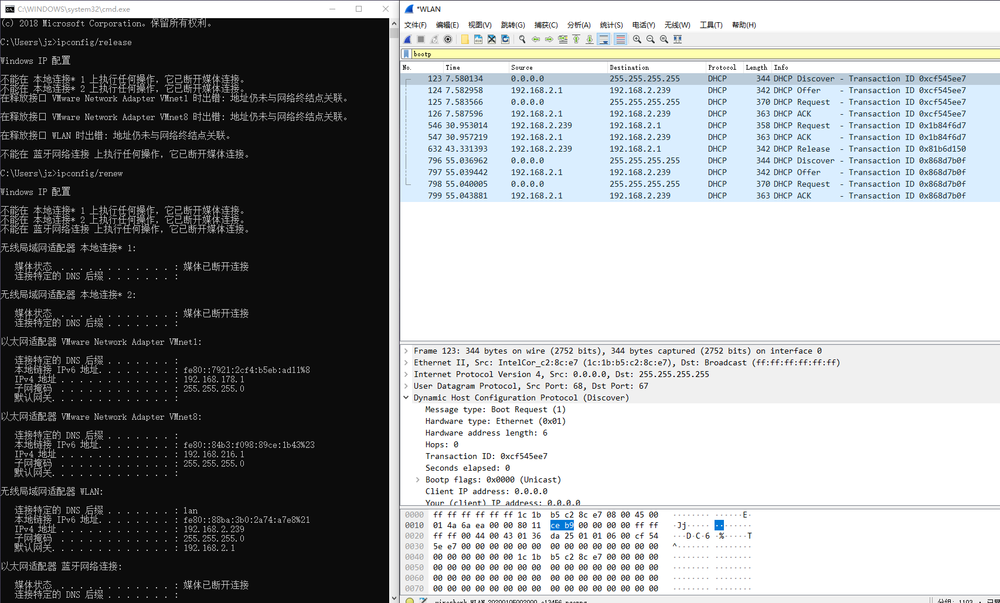

### Wireshark_DHCP

执行结果和wireshark结果图片：  

 

1. 通过UDP发送的。  

2. 顺序为：  
DHCP Discover, DHCP offer, DHCP Request, DHCP ACK  
DHCP服务器发送的目的IP地址并不和示例相同。  

3. 主机的以太网地址是：1c:1b:b5:c2:8c:e7  

4. DHCP中的option不同。  
比如DHCP Message Type,DHCP Server Identifier, Subnet Mask, broadcast address 等等。  

5. Transaction-ID 值是 0xcf545ee7。 
表示DHCP报文的ID，避免多个主机的DHCP报文接收混乱。  

6. 实验获取的报文与书中不同。  

| 序号 | 源IP | 目的IP | 
:---: | :---: | :---: 
| 1 | 0.0.0.0 | 255.255.255.255 | 
| 2 | 192.168.2.1 | 192.168.2.239 | 
| 1 | 0.0.0.0 | 255.255.255.255 | 
| 2 | 192.168.2.1 | 192.168.2.239 | 

7. DHCP服务器的IP地址为：192.168.2.1  

8. 发送Offer消息的DHCP服务器的IP地址为：192.168.2.1  
Your (client) IP address: 192.168.2.239  

9. 通过查询网络，可以了解到中继代理对于客户来说是透明的。  
Relay agent IP address 处填写中继代理，本实验室中是0.0.0.0，表明并无中介代理。  

10. 在Option字段中，表示当前连接的路由器和对应的子网。  

11. 使用下载的抓包结果，通过查看报文，是Option中的 Requested IP Address字段提供的。  

12. 可使用这个IP地址的时间。我实验中的租约时间为1天。  

13. 释放这个IP地址。如果客户端的 DHCP 释放消息丢了，服务器会依然认为这个IP地址被占用。  

14. ARP协议和数据链路层有关，还没学到，因此不讨论。  

