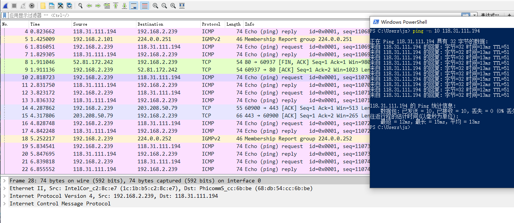
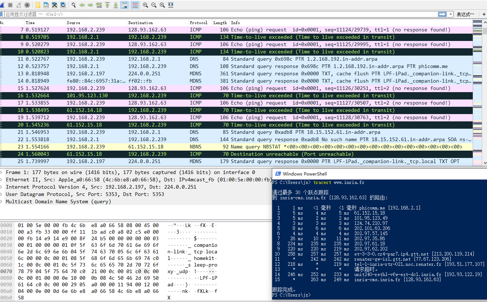

### Wireshark_ICMP 

### 1.ICMP协议和Ping程序   

执行结果和wireshark结果图片：  

 

1. 源主机的IP地址192.138.2.239，目标主机的IP地址是118.31.111.194  

2. 因为传输层才有端口号的概念，ICMP报文仅传送到主机。  

3. 类型8，代码0  
还包括校验和2字节 ，序列号2字节，标识符2字节  

4. 类型0，代码0  
还包括校验和2字节 ，序列号2字节，标识符2字节  

### 2.ICMP协议和Traceroute命令  

执行结果和wireshark结果图片：  
  

5. 源主机的IP地址192.138.2.239，目标主机的IP地址是128.93.162.63  

6. 如果发送了UDP数据包，则不是01，是UDP的协议号17。  
如果不是用UDP，则用ICMP的1。  

7. 具体的字段内容不同。  

8. 具体的字段内容不同，并没有更多的字段。  

9. 收到的最后三个数据报type是0，表示不是TTL用完返回的错误报文。  

10. 存在路由器延迟明显长于其他连接，甚至还存在超时现象。  
末端的路由器应该在法国。  

