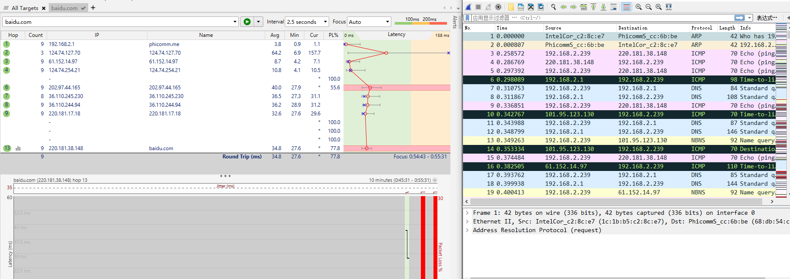

### Wireshark_IP

### 1.捕获执行traceroute的数据包  

执行结果和wireshark结果图片：  



使用自己捕获的报文来实验。  

1. 计算机的IP地址是192.168.2.239  

2. 上层协议字段的值是1  

3. IP header有20bytes。IP datagram 的有效负载中有36bytes。  
payload bytes =  Total Length - Header Length  

4. 没有被分片。如果分片后存在ID号相同的多个IP报文，且偏移量连续变化，Flag字段表示后面还有报文。  

5. TTL，首部检验和，Identification  

6.   
保持不变的有：  
Sources, Destination, Protocol, Header Length, Version  
必须保持不变的有：  
Sources, Destination, Protocol, Version  
必须更改的是：  
Header checksum, TTL, Identification  

7. Identification 随数据报的发送而增长。  

8. ID字段的值是0xa214，TTL字段的值是64  

9. 值都发生了变化  

10. IP数据报被分为了两段  

11. 
```
Frame 187: 1514 bytes on wire (12112 bits), 1514 bytes captured (12112 bits) on interface 0
Ethernet II, Src: IntelCor_c2:8c:e7 (1c:1b:b5:c2:8c:e7), Dst: PhicommS_cc:6b:be (68:db:54:cc:6b:be)
Internet Protocol Version 4, Src: 192.168.2.239, Dst: 220.181.38.148
    0100 .... = Version: 4
    .... 0101 = Header Length: 20 bytes (5)
    Differentiated Services Field: 0x00 (DSCP: CS0, ECN: Not-ECT)
    Total Length: 1500
    Identification: 0xff17 (65303)
    Flags: 0x2000, More fragments
    ...0 0000 0000 0000 = Fragment offset: 0
    Time to live: 1
    Protocol: ICMP (1)
    Header checksum: 0xce28 [validation disabled]
    [Header checksum status: Unverified]
    Source: 192.168.2.239
    Destination: 220.181.38.148
    Reassembled IPv4 in frame: 188
Data (1480 bytes)
    Data: 080011e400012a5f20202020202020202020202020202020…
    [Length: 1480]
```
从Flag中可以得知后面有更多的分片。  

12.  
```
Internet Protocol Version 4, Src: 192.168.2.239, Dst: 220.181.38.148
    0100 .... = Version: 4
    .... 0101 = Header Length: 20 bytes (5)
    Differentiated Services Field: 0x00 (DSCP: CS0, ECN: Not-ECT)
    Total Length: 520
    Identification: 0xff17 (65303)
    Flags: 0x00b9
        0... .... .... .... = Reserved bit: Not set
        .0.. .... .... .... = Don't fragment: Not set
        ..0. .... .... .... = More fragments: Not set
    ...0 0101 1100 1000 = Fragment offset: 1480
    Time to live: 1
    Protocol: ICMP (1)
    Header checksum: 0xf143 [validation disabled]
    [Header checksum status: Unverified]
    Source: 192.168.2.239
    Destination: 220.181.38.148
    [2 IPv4 Fragments (1980 bytes): #187(1480), #188(500)]
        [Frame: 187, payload: 0-1479 (1480 bytes)]
        [Frame: 188, payload: 1480-1979 (500 bytes)]
        [Fragment count: 2]
        [Reassembled IPv4 length: 1980]
        [Reassembled IPv4 data: 080011e400012a5f20202020202020202020202020202020…]
```
从Flag中可以得知后面没有分片。  

13. 发生变化的字段有：  
Total Length, Flags, Header checksum  

14. 创建了3个片段  

15. Total Length, Flags, Header checksum  