* **P1**  
   

* **P2**  
假设比特模式为： 1110 0110 1001 1101  
单比特差错：  
   
单比特差错可以被完整的定位到坐标，因此能够恢复。  
双比特差错：  
   
双比特差错至少出现三个校验位错误。（两行一列或者一行两列或者两行两列）  
   
对于图中两行两列的情况，可以是黄色的两个，也可以是棕色的两个，因此无法准确定位。  

* **P3**  
计算过程：  
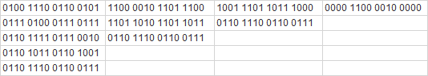   
检验和为： 1111 0011 1101 1111  

* **P4**  
a.  
计算过程：  
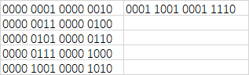   
检验和为： 1110 0110 1110 0001  
b.  
计算过程：  
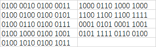   
检验和为： 1010 0000 1001 1011  
c.  
计算过程：  
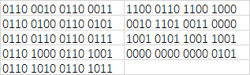   
检验和为： 1111 1111 1111 1010  

* **P5**  
题目中并未给出R的位数，通过网络其它人的答案得知，r为4  
则R为0100  

* **P6**  
a. R为0000  
b. R为1111  
c. R为1001  

* **P7**  
a. 因为如果发生任意单比特差错，生成多项式变无法整除，因此可以检测到。  
b. (来源于网络)对此题而言，一个关键点是：G 能被 11（二进制）整除，但任意奇数比特差错都不能整除11，因此也不能整除 G，所以可以检测出奇数比特差错。

* **P8**  
a.  
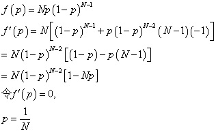   
b.  
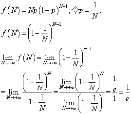   

* **P9**  
首先求令表达式最大的p值:  
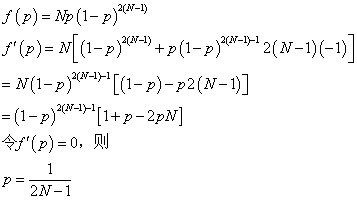   
再求N无穷时的效率：  
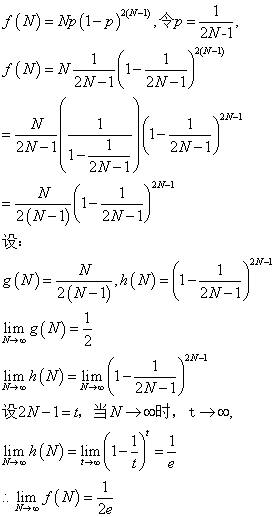   

* **P10**  
a.  
结点A的平均吞吐量：PA(1-PB)  
总体效率：  
PA(1-PB)+PB(1-PA)  
b.  
结点A的平均吞吐量：PA(1-PB) = 2PB(1-PB) = 2PB - 2PB2    
结点B的平均吞吐量：PB(1-PA) = PB(1-2PB) = PB- 2PB2  
显然不是两倍的关系  
如果想要两倍关系成立，则：  
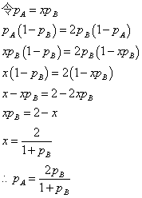   
c.  
结点A的吞吐量：2p(1-p)N-1  
其它结点的吞吐量：p(1-p)N-2(1-2p)    

* **P11**  
疑问:时隙5首次成功的意思，是代表时隙1-4都是不成功么？下面按照这个推论进行计算。  
a. (1 - p(1-p)3)4p(1-p)3  
b. 4p(1-p)3  
c. (1 - 4p(1-p)3)24p(1-p)3  
d. 4p(1-p)3  

* **P12**  
Python画图代码：[efficiencyPlot.py](PA-P12/efficiencyPlot.py)  
蓝色的线是时隙ALOHA，橙色的线是纯ALOHA  
a.  
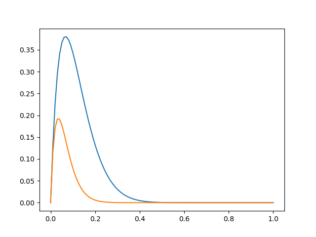   
b.  
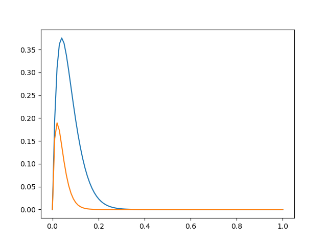   
c.  
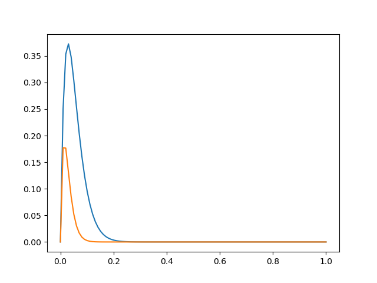   

* **P13**  
设所有结点都需要传输时取得最大吞吐量  
则总时间为： N(Q/R + dpoll)  
最大吞吐量为： NQ/N(Q/R + dpoll) = Q/(Q/R + dpoll)  

* **P14**  
设两台路由器分别为左路由和右路由，接口分别为左接口和右接口  
a.  
A 192.168.1.1  
B 192.168.1.2  
左路由左接口 192.168.1.3  
C 192.168.2.1  
D 192.168.2.2  
左路由右接口 192.168.2.3  
右路由左接口 192.168.2.4  
E 192.168.3.1  
F 192.168.3.2  
右路由右接口 192.168.3.3  
b.  
A 01-01-01-01-01-01  
B 02-02-02-02-02-02  
左路由左接口 03-03-03-03-03-03  
C 04-04-04-04-04-04  
D 05-05-05-05-05-05  
左路由右接口 06-06-06-06-06-06  
右路由左接口 07-07-07-07-07-07  
E 08-08-08-08-08-08  
F 09-09-09-09-09-09  
右路由右接口 0A-0A-0A-0A-0A-0A  
c.  
疑问：“最新”表示ARP表是正确的，里面包含所有适配器的信息。“空”表示ARP表为空。下面按照这个推论进行描述。  
步骤：  
1. 主机E首先查询转发表，且向ARP表查询右路由右接口IP地址对应的MAC地址，向右路由右接口发送数据报。  
2. 到达右路由右接口后，通过路由器的转发到右路由左接口。
3. 右路由左接口向ARP表查询左路由右接口IP地址对应的MAC地址，向左路由右接口发送数据报。  
4. 到达左路由右接口后，通过路由器的转发到左路由左接口。  
5. 右路由左接口向ARP表查询主机BIP地址对应的MAC地址，向主机B发送数据报。  
6. 主机B收到数据报，提取处报文内容向上层传递。   
d.  
1. 主机E首先查询转发表，知道应该向右路由右接口IP地址发送数据包，但是没有该IP地址的MAC地址，于是发送ARP广播查询报文。  
2. 主机E收到查询报文后，可以构造一个数据报发送给右路由右接口。  
后面的步骤与c相同。  

* **P15**  
IP地址和MAC地址依然使用P14中定义的。  
a.  
主机E不请求路由器R1帮助转发该数据报。  
源IP地址：192.168.3.1    
目的IP地址：192.168.3.2  
源MAC地址：08-08-08-08-08-08  
目的MAC地址：09-09-09-09-09-09  
b.  
E不执行ARP协议来发现B的MAC地址。因为E和B并不在一个局域网中。  
源IP地址：192.168.3.1    
目的IP地址：192.168.3.3  
源MAC地址：08-08-08-08-08-08  
目的MAC地址：0A-0A-0A-0A-0A-0A  
c.  
交换机S1收到ARP请求报文时，会增加表项，记录下到达的接口和MAC地址。  
由于请求报文是广播MAC地址，因此路由器R1会收到ARP请求报文。  
由于目的IP不同，因此路由器R1不会向子网3转发该报文。  
不清楚ARP协议是如何实现的，但是IP地址是本局域网内的，因此IP和MAC地址可以对应，因此ARP表中是可以直接添加对应表项的。  
交换机会只向主机A所在的端口发送数据报。  

* **P16**  
疑问：此时子网1和2中间的路由器恢复正常。下面按照这个推论进行描述。  
IP地址和MAC地址依然使用P14中定义的。(此时子网2的所有IP地址应该都换了)  
a.  
主机E不请求路由器R1帮助转发该数据报。  
源IP地址：192.168.3.1    
目的IP地址：192.168.3.2  
源MAC地址：08-08-08-08-08-08  
目的MAC地址：09-09-09-09-09-09  
b.  
E不执行ARP协议来发现B的MAC地址。因为E和B并不在一个局域网中。  
源IP地址：192.168.3.1    
目的IP地址：192.168.3.4  
源MAC地址：08-08-08-08-08-08  
目的MAC地址：06-06-06-06-06-06  
c.  
交换机S1收到ARP请求报文时，会增加表项，记录下到达的接口和MAC地址。  
由于请求报文是广播MAC地址，因此路由器R1会收到ARP请求报文。  
由于目的IP不同，因此路由器R1不会向子网3转发该报文。  
不清楚ARP协议是如何实现的，但是IP地址是本局域网内的，因此IP和MAC地址可以对应，因此ARP表中是可以直接添加对应表项的。  
交换机会只向主机A所在的端口发送数据报。  

* **P17**  
10Mbps的信道： 51.2μs * 100 = 5.12ms  
100Mbps的信道： 5.12μs * 100 = 512μs  

* **P18**  
A检测到B已经传输之前，A是可以完成传输的。假设A已经传输了300比特，B认为信道中没有使用，因此可以开始传输，传输了25比特后，B侦听到A的报文，发生了碰撞。  
则A收到B的20个比特的第一个时，已经经过了300+325 = 625比特。此时A很可能已经传输结束了。  
（并未使用提示）  
在最坏的情况下，A传输的第一个结点即将到达B时，B开始传输。  
B的比特到达A时的时间为: 324 + 325 = 649  

* **P19**  
t = 245比特时，检测到碰撞，A和B都停止传输。  
t = 245 + 245 = 490 比特时，信道空闲。  此时A开始传输。  
假设A的帧长度为 512 + 64，则t = 490 + 245 + 576 = 1311比特时，B接收完毕。  
B在490比特时开始等待，等待512比特，t = 1002时，A正在传输，信道非空闲，因此B在预定的时刻需要抑制传输。  

* **P20**  
标准答案没有看懂。  

* **P21**  
IP和MAC地址使用P14的定义。  
(i)  
源IP地址：192.168.1.1  
目的IP地址：192.168.3.2  
源MAC地址：01-01-01-01-01-01  
目的MAC地址：03-03-03-03-03-03  
(ii)  
源IP地址：192.168.1.1  
目的IP地址：192.168.3.2  
源MAC地址：06-06-06-06-06-06  
目的MAC地址：07-07-07-07-07-07  
(iii)  
源IP地址：192.168.1.1  
目的IP地址：192.168.3.2  
源MAC地址：0A-0A-0A-0A-0A-0A  
目的MAC地址：09-09-09-09-09-09  

* **P22**  
疑问：左边没有路由器了，又如何出现“左路由器”？下面把“左路由器”认为是左交换机。  
IP和MAC地址使用P14的定义，其中子网2消失，并入子网3的地址。  
(i)  
源IP地址：192.168.1.1  
目的IP地址：192.168.3.2  
源MAC地址：01-01-01-01-01-01  
目的MAC地址：07-07-07-07-07-07  
(ii)  
源IP地址：192.168.1.1  
目的IP地址：192.168.3.2  
源MAC地址：01-01-01-01-01-01  
目的MAC地址：07-07-07-07-07-07  
(iii)  
源IP地址：192.168.1.1  
目的IP地址：192.168.3.2  
源MAC地址：0A-0A-0A-0A-0A-0A  
目的MAC地址：09-09-09-09-09-09  

* **P23**  
（来源于标准答案）   
最大聚合吞吐量为所有结点都在传输数据，为(9+2)*100 = 1100Mbps  

* **P24**  
最大聚合吞吐量为(3+2)*100 = 500Mbps  

* **P25**  
最大聚合吞吐量为100Mbps  

* **P26**  
(i) 表中添加B的MAC地址和接口，并广播该帧。  
(ii) 表中添加E的MAC地址和接口，并向B转发该帧。  
(iii) 表中添加A的MAC地址和接口，并向B转发该帧。  
(iv) 向A转发该帧。  

* **P27**  
a. 分组化时延为L/16k  
b.  
L=1500字节时，分组化时延为93.75ms  
L=50字节时，分组化时延为3.125ms  
c.  
L=1500字节时，存储转发时延为(1500+5)*8/622M = 19.35μs  
L=50字节时，分组化时延为93.75ms，存储转发时延为(50+5)*8/622M = 0.71μs  
d. 小分组时延低，用户体验更好  

* **P28**  
假设EE4主机要往CS10主机发送数据。  
1. EE4主机的目标IP地址是CS10，通过ARP协议了解到应该转发往路由器接口的MAC地址，然后发往交换机。  
2. 交换机4口收到帧，通过查询交换机表，知道路由器接口的MAC地址对应1口，于是转发往1口。  
3. 路由器收到帧，提取IP报文，通过查询路由器转发表，转发该报文，目的MAC地址是CS10的MAC地址。  
4. 交换机16口收到帧，通过查询交换机表，知道CS10的MAC地址对应10口，于是转发往10口。  
5. CS10收到帧，提取报文。  

* **P29**  
R4表  

| 入标签 | 出标签 | 目的地 | 出接口 |  
:---: | :---: | :---: | :---: 
| 2 | 10 | A | 0 | 
| 1 | 12 | D | 0 | 
| 3 | 8 | A | 1 | 

R5表  

| 入标签 | 出标签 | 目的地 | 接口 |  
:---: | :---: | :---: | :---: 
| 4 | 3 | A | 0 | 

R6表  

| 入标签 | 出标签 | 目的地 | 接口 |  
:---: | :---: | :---: | :---: 
| 5 | 2 | A | 0 | 

* **P30**  
R1表  

| 入标签 | 出标签 | 目的地 | 出接口 |  
:---: | :---: | :---: | :---: 
| 6 | - | A | 0 | 
| 16 | 12 | D | 1 |

R2表  

| 入标签 | 出标签 | 目的地 | 出接口 |  
:---: | :---: | :---: | :---: 
| 8 | 6 | A | 0 | 
| 15 | 16 | D | 0 | 

R3表  

| 入标签 | 出标签 | 目的地 | 出接口 |  
:---: | :---: | :---: | :---: 
| 10 | 6 | A | 1 | 
| 12 | - | D | 0 | 

R4表  

| 入标签 | 出标签 | 目的地 | 出接口 |  
:---: | :---: | :---: | :---: 
| 2 | 10 | A | 0 | 
| 1 | 12 | D | 0 | 
| 3 | 8 | A | 1 | 
| 14 | 15 | D | 1 | 

R5表  

| 入标签 | 出标签 | 目的地 | 接口 |  
:---: | :---: | :---: | :---: 
| 4 | 3 | A | 0 | 
| 13 | 14 | D | 0 | 

R6表  

| 入标签 | 出标签 | 目的地 | 接口 |  
:---: | :---: | :---: | :---: 
| 5 | 2 | A | 0 | 
| 11 | 1 | D | 0 | 

* **P31**  
5.7节的回顾内容即是本题答案。  

* **P32**  
a.  
1. 主机和Tor交换机的限制： 1Gbps  
2. Tor交换机到第二层交换机的限制： 10Gbps/10 = 1Gbps  
3. 第二层交换机到第一层交换机的限制： 10Gbps/40 = 250Mbps  
4. 第一层交换机到路由器的限制： 10Gbps/80 = 125Mbps  
b. 疑问： 采用图5-31的结构，而不是采用图5-30的结构，区别除了高度互联，第一层交换机还多了两个。  
1. 主机和Tor交换机的限制： 1Gbps  
2. Tor交换机到第二层交换机的限制： 10Gbps/10 = 1Gbps  
3. 第二层交换机到第一层交换机的限制： 4 * 10Gbps/40 = 1Gbps  
c. 
等级拓扑：  
a.  
1. 主机和Tor交换机的限制： 1Gbps  
2. Tor交换机到第二层交换机的限制： 10Gbps/20 = 500bps  
3. 第二层交换机到第一层交换机的限制： 10Gbps/80 = 125Mbps  
4. 第一层交换机到路由器的限制： 10Gbps/160 = 62.5Mbps  
高度互联拓扑：  
1. 主机和Tor交换机的限制： 1Gbps  
2. Tor交换机到第二层交换机的限制： 10Gbps/20 = 500Mbps  
3. 第二层交换机到第一层交换机的限制： 4 * 10Gbps/80 = 500Mbps  

* **P33**  
a. 0.1%  
b. 0.001 * 0.001 = 10-6  
c. 可以让视频和邮件应用共享一个“第7”服务器，两边的第二层交换机都与它连接。  
(标准答案没看懂是如何处理的)  
