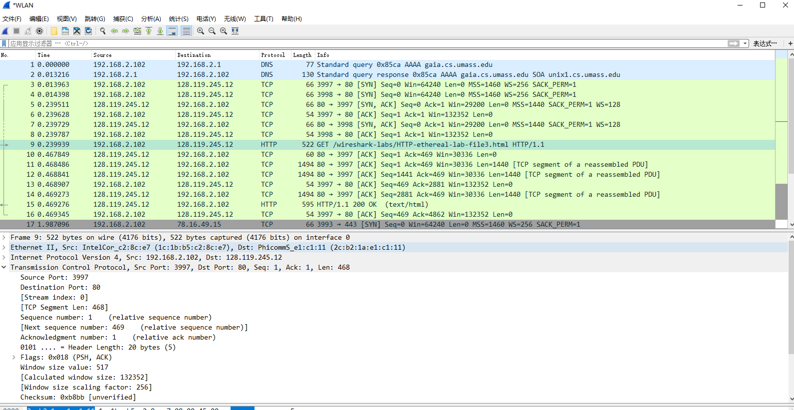
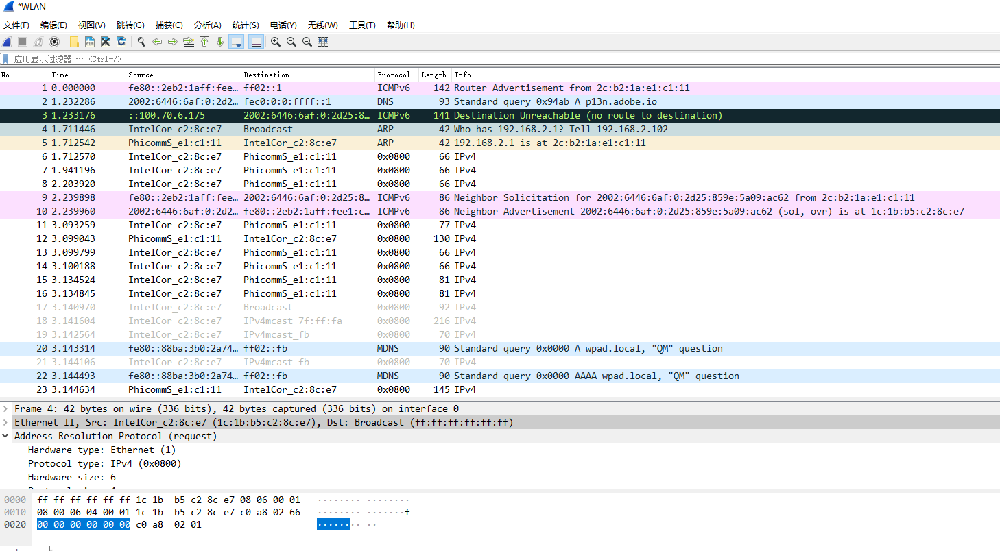

### Wireshark_Ethernet_ARP  

### 1.捕获和分析以太网帧  

执行结果和wireshark结果图片：  

  

1. 1c:1b:b5:c2:8c:e7  

2. 2c:b2:1a:e1:c1:11  
不是gaia.cs.umass.edu的以太网地址。  

3. 0x0800，对应IPv4  

4. 54字节  

5. 以太网源地址的值是2c:b2:1a:e1:c1:11，拥有这个以太网地址的设备是与我电脑连接的路由器接口的地址。  

6. 以太网帧中的目的地址是1c:1b:b5:c2:8c:e7，是我计算机的以太网地址。  

7. 0x0800，对应IPv4  

8. 67字节  

### 2.地址解析协议  

9.  
```
arp -a

接口: 192.168.178.1 --- 0x8
  Internet 地址         物理地址              类型
  192.168.178.254       00-50-56-f4-6b-c2     动态
  192.168.178.255       ff-ff-ff-ff-ff-ff     静态
  224.0.0.2             01-00-5e-00-00-02     静态
  224.0.0.22            01-00-5e-00-00-16     静态
  224.0.0.251           01-00-5e-00-00-fb     静态
  224.0.0.252           01-00-5e-00-00-fc     静态
  239.255.255.250       01-00-5e-7f-ff-fa     静态
  255.255.255.255       ff-ff-ff-ff-ff-ff     静态

接口: 192.168.2.102 --- 0x15
  Internet 地址         物理地址              类型
  192.168.2.1           2c-b2-1a-e1-c1-11     动态
  192.168.2.103         f4-60-e2-90-bc-7c     动态
  192.168.2.255         ff-ff-ff-ff-ff-ff     静态
  224.0.0.2             01-00-5e-00-00-02     静态
  224.0.0.22            01-00-5e-00-00-16     静态
  224.0.0.251           01-00-5e-00-00-fb     静态
  224.0.0.252           01-00-5e-00-00-fc     静态
  239.255.255.250       01-00-5e-7f-ff-fa     静态
  255.255.255.255       ff-ff-ff-ff-ff-ff     静态

接口: 192.168.216.1 --- 0x17
  Internet 地址         物理地址              类型
  192.168.216.254       00-50-56-f0-0d-de     动态
  192.168.216.255       ff-ff-ff-ff-ff-ff     静态
  224.0.0.2             01-00-5e-00-00-02     静态
  224.0.0.22            01-00-5e-00-00-16     静态
  224.0.0.251           01-00-5e-00-00-fb     静态
  224.0.0.252           01-00-5e-00-00-fc     静态
  239.255.255.250       01-00-5e-7f-ff-fa     静态
  255.255.255.255       ff-ff-ff-ff-ff-ff     静态
```

执行结果和wireshark结果图片：  

  

10.  
源地址：1c:1b:b5:c2:8c:e7  
目标地址：ff:ff:ff:ff:ff:ff  

11. 0x0806 ARP  

下面的内容直接分析Wireshark结果  

12.  
a) 不包含opcode开始，有20个字节  
b) 0x0001  
c) 包含发送方的IP地址  
d) 目标IP地址  

13. 
a) 不包含opcode开始，有20个字节  
b) 0x0002  
c) 发送方IP和发送方MAC地址  

14. 
源地址：2c:b2:1a:e1:c1:11  
目标地址：1c:1b:b5:c2:8c:e7  

15. 可能因为对应的IP地址并不存在。  

### Extra Credit 额外实验  

EX-1.  
尝试更改，但是失败  
```
PS C:\WINDOWS\system32> arp -d *
PS C:\WINDOWS\system32> arp -s 192.168.2.1 11-11-11-11-11-11 -N 192.168.2.102
ARP 项添加失败: 拒绝访问。
```

EX-2. 没有查到  
