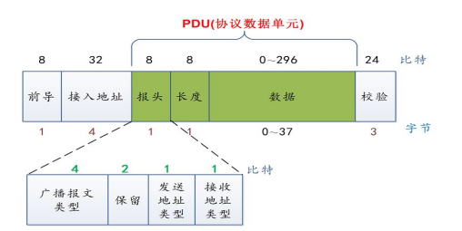
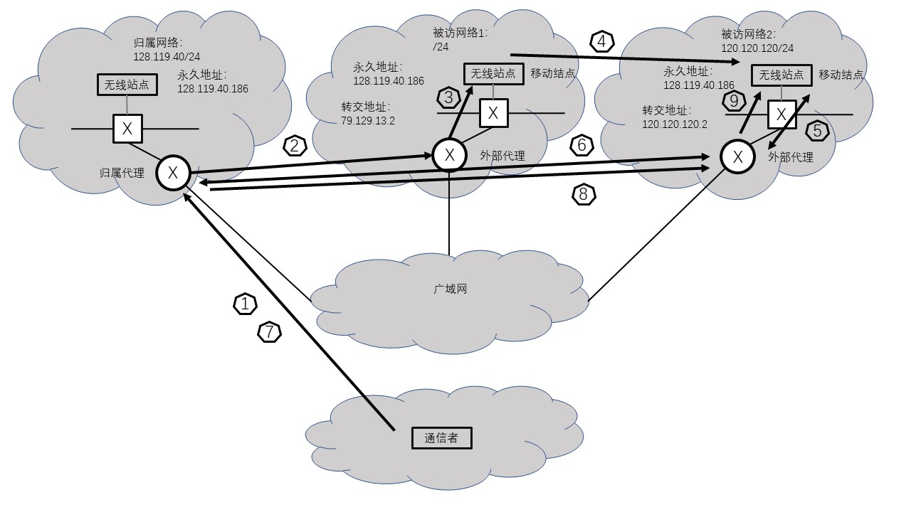

* **P1**  
疑问：我理解为求发送方的输出  
-1，1，-1，1，-1，1，-1，1， 1，-1，1，-1，1，-1，1，-1  

* **P2**  
1，-1，1，1，1，-1，1，1， 1，-1，1，1，1，-1，1，1，  

* **P3**  
使用图6-6的计算方式，CDMA编码为信道2的编码即可计算得出。  

* **P4**  
疑问：我的理解是，应该是给出CDMA编码，使得两个接收方无法提取出初始传输的比特。  
编码1： 1，-1，1，-1，-1，1，-1，1  
编码2： -1，1，-1，1，1，-1，1，-1  
1经过编码1后为 1，-1，1，-1，-1，1，-1，1  
1经过编码2后为 1，-1，1，-1，-1，1，-1，1  
和为 0，0，0，0，0，0，0，0  
接收方无法恢复  

* **P5**  
a.  
不会发生完全崩溃。因为有CSMA/CA机制。  
试图同时传输时，首先会侦听信道，如果信道已经有数据在传输，就随机回退，再进行传输。  
如果发生碰撞，比如严格时间上同时传输，那么检测到碰撞后随机回退，再进行传输。  
b.  
1和11信道非重叠，因此不产生碰撞。  

* **P6**  
如果该无线站点在使用信道，那么其它站点则不会传输，此时正常情况下应该不会有别的站点与它争抢信道。  

* **P7**  
数据的传输时延为： 1000 * 8 / (11 * 106) = 0.73ms  
时间为：DIFS + 3 * SIFS + 0.73ms  

* **P8**  
设单个报文传输的速率为M  
a.  
最大速率为M/2  
因为C向B发送时，B不能向A发送。  
b.  
最大组合速率为2M  
因为A向B发送报文时，不影响D向C发送。  
c.  
最大组合速率为M  
因为在同一时间，B能收到A发送的报文，也能收到D向C发送的报文，因此不能同时发送。   
d.  
a情况：最大速率为M  
b情况：最大组合速率为2M  
c情况：最大组合速率为2M  
e.  
a情况：最大速率为M/4  
b情况：最大组合速率为M  
c情况：最大组合速率为M/2  

* **P9**  
蓝牙帧的格式：（来源于网络）  
   
通过网上的分析，我了解到接入地址是有结构限制的，最多可能231个，但是不清楚为什么主动结点的数量为8。  

* **P10**  
a.  
最大速率是10Mbps  
这个解决方案公平，因为只向结点A发送。  
公平可以定义为每个结点收到等量的数据，或者每个结点所占的传输时间相等。  
b.  
( 10M + 5M * 2 + 2.5M * 4 + 1M * 10) / 17 = 2.35Mbps  
c. 
不会做，也不太理解题意。  

* **P11**  
a.  
不可能立即做出新的路由选择，因为路由通告是需要花费时间的，尤其是跨越全球的域间路由。  
b.  
只有部分路由器收到通告时，不同的路由器可能认为移动用户位于不同的外部网络中。  
c.  
约为TTL/2，甚至更长  

* **P12**  
额外的网络层基础设施： 归属代理，外部代理  
发送的数据报如图所示：  

   

1. 通信者首先转发报文到归属代理。
2. 归属代理转发报文到被访网络1，交给外部代理，使用数据包封装。  
3. 外部代理提取数据报，发送给无线站点。
4. 无线站点移动到被访网络2。  
5. 无线站点向被访网络2的外部代理注册。
6. 被访网络2的外部代理向归属代理注册。  
7. 通信者首先转发报文到归属代理。
8. 归属代理转发报文到被访网络2，交给外部代理，使用数据包封装。  
9. 外部代理提取数据报，发送给无线站点。  

* **P13**  
移动性对于端到端时延有很大的影响。  
1. 由于归属代理转发报文，并不是直接路由到无线站点，因此增加了时延。  
2. 移动到不同的网络时需要进行注册，需要一定的时间进行处理，此时可能产生时延很大的现象。  

* **P14**  
疑问：最后讨论的哪个例子？使用锚MSC还是不使用？  
报文序列是什么？书上最后只讲了MSC的切换问题。  
下面只描述MSC的切换。  
使用锚MSC时：   
1. 移动用户在外部网络A。通信者发起呼叫  
2. 通信者报文首先到HLR，再找到外部网络A的VLR，成功连接移动用户。外部网络A作为锚MSC。  
3. 移动用户从A走到外部网络B，外部网络A收到报文后，转交给外部网络B。
4. 移动用户走到外部网络C，外部网络A收到报文后，转交给外部网络C。  

不使用锚MSC，使用链接时：   
1. 移动用户在外部网络A。通信者发起呼叫  
2. 通信者报文首先到HLR，再找到外部网络A的VLR，成功连接移动用户。  
3. 移动用户从A走到外部网络B，外部网络B的VLR向HLR注册。
4. 通信者的报文先通过HLR，再到外部网络B，再到移动用户。
5. 移动用户走到外部网络C，外部网络C的VLR向HLR注册。
6. 通信者的报文先通过HLR，再到外部网络C，再到移动用户。  

* **P15**  
可以使用相同的转交地址，因为在广域网中传送时使用封装后的数据报，目的地址都是外部网络。  
在外部网络内部，使用数据链路层的转发，用MAC地址传送数据，由于两个的结点的永久IP不同，可以对应到不同的MAC地址上，因此可能正常接收数据链路层报文，因此可以使用同样的转交地址。  

* **P16**  
提供MSRN：相当于提供了“IP地址”，可直接用该地址发送报文。  
提供VLR地址：还要去该VLR查询MSRN，造成额外的时延。  

