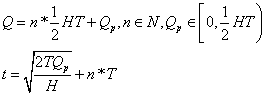
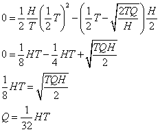
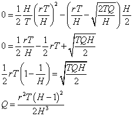
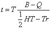
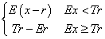
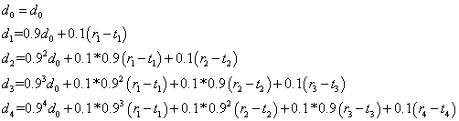
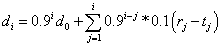
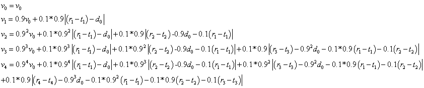
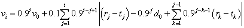
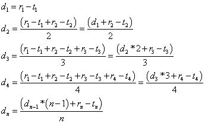

* **P1**  
a. 1，4，5，6块能够及时播放。通过画一个第一块一到达就开始播放的折线图来得出。  
b. 1，4，5，6块能够及时播放。通过画一个t1+Δ开始播放的折线图来得出。  
c. 缓存最多为2。通过视频接收和播放的折线图的差的最大值就能得到。  
d. 最小的播放时延为3Δ。通过使得视频接收和播放的折线图不重合的最小时延值求得。

* **P2**  
播放期长度：Q/(r-x)  
停滞期长度：(B-Q)/(x-r)  

* **P3**  
a. 平均发送速率为H/2。  
b. 这要看播放的速率和H的关系，以及快的大小。  
如果块相对于重复周期较小，以至于收到第一个块播放完成之后的收不到第二个块，那么就会发生停滞。  
c.   
   
d. 当H=2r时，此时在时间T正好播放(1/2)HT的内容，也正好传输进(1/2)HT。  
在Q=HT/2时，播放完Q中的内容后，正好时间到T，此时又传输进(1/2)HT的内容，远远满足播放条件，可以进行播放。  
因此每个播放循环中都不会停滞。  
e. 由于H>2r，因此开始播放的时间不会晚于(1/2)T。设H=2r。  
设在时间t开始播放，那么0-t时是积累Q的阶段，t-(1/2)T 时间是消耗Q的阶段，需要保证消耗的小于等于Q。  
假设消耗的等于Q，那么到(1/2)T 时间后就开始积累字节，一直到时间T。通过观察图像的面积，可以发现积累的面积正好能够填补后面一个低值的空缺，使得后面的所有循环都变为一个H/2的直线。  
   
这也是一个上界，由于H>2r，实际上不到(1/2)T 的时间就开始积累字节了。  
   
这应该是确界。  
f.  当H=2r时，除非Q过大，或者B过小（例如小于(1/2)HT）否则一般不会变满。  
当H>2r时,我认为参数必须加上r，否则无法正确计算。  
我们来简单计算，省略Q带来的比特率波动，使得开始播放时从位置0开始。  
   

* **P4**  
疑问：不应该是压缩率为r，应该是消耗率为r  
a. 浪费了 E(x-r)  
b. 浪费了  
   

* **P5**  
a. N2  
b. 2N  

* **P6**  
书上翻译错误，是ms而不是秒。  
例子使用7.3.1节第二段的例子。  
a. 20ms 发送 160+h B  
速率为 64000+400h bps  
b. 书上并没有讲RTP的首部长度，通过查询网络，得知RTP首部为12字节。  
首部总长度为 12 + 20 + 8 = 40字节  

* **P7**  
设初值为d0  
a.  
   
b.  
设初值为d0  
   

* **P8**  
设初值为v0  
a.  
   
b.  
   

* **P9**  
a.  
  
b.  
因为随着传输时间的增加，每个时延的占比越来越小，而且占比是平均的。但是现实中，网络时延是可能根据时间变化的，距离最近的时间的时延对我们估计当前的平均时延更有帮助一些，因此不采用a中的方法。  

* **P10**  
公式和采用的思想是相同的，但是参数设置区别较大。因为时延变化的随机性特别高，因此不能设置距离最近的时延占比太大。  

* **P11**  
a.  

| 分组 | 时延 | 
:---: | :---: | 
| 2 | 7 | 
| 3 | 9 | 
| 4 | 8 | 
| 5 | 7 | 
| 6 | 9 | 
| 7 | 8 | 
| 8 | 8 | 

b. 3,4,6,7,8  
c. 3,6  
d. t=10时开始播放  

* **P12**  
a.  

| 分组 | 估计时延 | 
:---: | :---: | 
| 2 | 7 | 
| 3 | 7.2 | 
| 4 | 7.28 | 
| 5 | 7.252 | 
| 6 | 7.4268 | 
| 7 | 7.48412 | 
| 8 | 7.535708 | 

b.  

| 分组 | 估计时延偏差 | 
:---: | :---: | 
| 2 | 0 | 
| 3 | 0.18 | 
| 4 | 0.234 | 
| 5 | 0.2358 | 
| 6 | 0.36952 | 
| 7 | 0.384156 | 
| 8 | 0.3921696 | 

* **P13**  
a. 都需要25%的额外带宽。  
方案1如果出现丢失则是4个分组的时延。  
方案2如果出现丢失则是1个分组的时延。  
b.  
方案1: 等待第5个分组到达，然后重建丢失的分组，再开始播放。  
方案2: 等待下一个分组到达，然后使用低质量的比特率。  
方案1有更好的音频质量。  
c.  
方案1: 等待第5个分组到达，然后重建丢失的分组，再开始播放。  
方案2: 等待下一个分组到达，然后使用低质量的比特率。  
方案1有更好的音频质量。  

* **P14**  
a. 发起方每秒需要发送 (N-1)r 比特  
其它与会者需要每秒发送r比特  
总的发送速率是 2(N-1)r  
b. 发起方每秒需要发送 r 比特  
其它与会者需要每秒发送 r 比特  
总的发送速率是 Nr (不包含服务器)  
c. 发起方每秒需要发送 (N-1)r 比特  
其它与会者需要每秒发送 (N-1)r 比特  
总的发送速率是 N(N-1)r  

* **P15**  
a. 会被同一个套接字接收。  
b. 足够，使用源IP和端口号来区分。  

* **P16**  
a. 正确。  
b. 有可能？书上未提  
c. 错误。  
d. 错误。  
e. 正确，书上原话。  
f. 错误，这一行是接收的音频类型  
g. 错误，它的接收端口是48753  
h. 正确。  
i. 正确。  
f. 不清楚  

* **P17**  
a. 1123112311231123....  
b. 112112112112....  

* **P18**  
（未给出u，因此不按照适应性公式计算，而是按照绝对的平均时延）  
a.  

| 分组 | 离开时间 | 时延 | 
:---: | :---: | :---: | 
| 1 | 1 | 0 | 
| 2 | 2 | 1 | 
| 3 | 3 | 1 | 
| 4 | 4 | 2 | 
| 5 | 6 | 2 | 
| 6 | 5 | 2 | 
| 7 | 7 | 3 | 
| 8 | 8 | 2 | 
| 9 | 9 | 3 | 
| 10 | 10 | 2 | 
| 11 | 11 | 2 | 
| 12 | 12 | 3 | 

平均时延：1.92  

b. 

| 分组 | 离开时间 | 时延 | 
:---: | :---: | :---: | 
| 1 | 1 | 0 | 
| 2 | 3 | 2 | 
| 3 | 2 | 0 | 
| 4 | 7 | 5 | 
| 5 | 4 | 0 | 
| 6 | 8 | 5 | 
| 7 | 5 | 1 | 
| 8 | 10 | 4 | 
| 9 | 6 | 0 | 
| 10 | 11 | 3 | 
| 11 | 9 | 0 | 
| 12 | 12 | 3 | 

平均时延：1.92  

c. 

| 分组 | 离开时间 | 时延 | 
:---: | :---: | :---: | 
| 1 | 1 | 0 | 
| 2 | 3 | 2 | 
| 3 | 5 | 3 | 
| 4 | 2 | 0 | 
| 5 | 4 | 0 | 
| 6 | 7 | 4 | 
| 7 | 6 | 2 | 
| 8 | 8 | 2 | 
| 9 | 10 | 4 | 
| 10 | 12 | 4 | 
| 11 | 9 | 0 | 
| 12 | 11 | 2 | 

平均时延：1.92  

d.  
中文版书居然漏掉了权重！类型1的权重2，类型2的权重1  

| 分组 | 离开时间 | 时延 | 
:---: | :---: | :---: | 
| 1 | 1 | 0 | 
| 2 | 3 | 2 | 
| 3 | 2 | 0 | 
| 4 | 6 | 4 | 
| 5 | 4 | 0 | 
| 6 | 8 | 5 | 
| 7 | 5 | 1 | 
| 8 | 10 | 4 | 
| 9 | 7 | 1 | 
| 10 | 11 | 3 | 
| 11 | 9 | 0 | 
| 12 | 12 | 3 | 
 
平均时延：1.92  

e.  
平均时延相同。  

* **P19**  

a. 

| 分组 | 离开时间 | 时延 | 
:---: | :---: | :---: | 
| 1 | 1 | 0 | 
| 2 | 5 | 4 | 
| 3 | 6 | 4 | 
| 4 | 2 | 0 | 
| 5 | 4 | 0 | 
| 6 | 3 | 0 | 
| 7 | 7 | 3 | 
| 8 | 8 | 2 | 
| 9 | 10 | 4 | 
| 10 | 11 | 3 | 
| 11 | 9 | 0 | 
| 12 | 12 | 3 | 
 
平均时延：1.92  

b.  

| 分组 | 离开时间 | 时延 | 
:---: | :---: | :---: | 
| 1 | 1 | 0 | 
| 2 | 2 | 1 | 
| 3 | 4 | 2 | 
| 4 | 3 | 1 | 
| 5 | 7 | 3 | 
| 6 | 5 | 2 | 
| 7 | 6 | 2 | 
| 8 | 8 | 2 | 
| 9 | 10 | 4 | 
| 10 | 11 | 3 | 
| 11 | 9 | 0 | 
| 12 | 12 | 3 | 
 
平均时延：1.92  

c.  

| 分组 | 离开时间 | 时延 | 
:---: | :---: | :---: | 
| 1 | 1 | 0 | 
| 2 | 2 | 1 | 
| 3 | 3 | 1 | 
| 4 | 4 | 2 | 
| 5 | 7 | 3 | 
| 6 | 10 | 7 | 
| 7 | 5 | 1 | 
| 8 | 6 | 0 | 
| 9 | 8 | 2 | 
| 10 | 9 | 1 | 
| 11 | 12 | 3 | 
| 12 | 11 | 2 | 
 
平均时延：1.92  

* **P20**  

| 时隙 | 队列 | 令牌数 | 输出链路分组 | 
:---: | :---: | :---: | :---: | 
| 0 | 1 2 3 | 2 | 1 2 |
| 1 | 3 4 | 1 | 3 | 
| 2 | 4 5 | 1 | 4 | 
| 3 | 5 6 | 1 | 5 | 
| 4 | 6 | 1 | 6 | 
| 5 |  | 1 |  | 
| 6 | 7 8 | 2 | 7 8 | 
| 7 | 9 10 | 1 | 9 | 
| 8 | 10 | 1 | 10 | 

* **P21**  

| 时隙 | 队列 | 令牌数 | 输出链路分组 | 
:---: | :---: | :---: | :---: | 
| 0 | 1 2 3 | 2 | 1 2 |
| 1 | 3 4 | 2 | 3 4 | 
| 2 | 5 | 2 | 5 | 
| 3 | 6 | 2 | 6 | 
| 4 |  | 2 |  | 
| 5 |  | 2 |  | 
| 6 | 7 8 | 2 | 7 8 | 
| 7 | 9 10 | 2 | 9 10 | 
| 8 |  | 2 |  | 

* **P22**  
r=3时无变化，和P21回答相同。因为每个时隙生产3个令牌，但是最多放进桶里两个，与生产两个实际相同。  

* **P23**  
查找了一些文档，使用“双速率三色令牌桶”算法。  
但是这里显然用不到三色，只要双速率就足够了。  
两个桶设定不同的r和b，然后报文首先经过第一个桶，再经过第二个桶，两个都经过才可以输出。  
没有找到直接描述如何监管峰值速率的资料，不清楚如何实现监管。  

* **P24**  
疑问：感觉中文翻译的有问题  
1. 分组不是必须等待，如果循环正好轮到该队列就不用等待。  
2. 分组并不是符合哪个漏桶规范就去哪个队列，而是根据分组本身的队列标记决定。  

* **P25**  
不会。  
