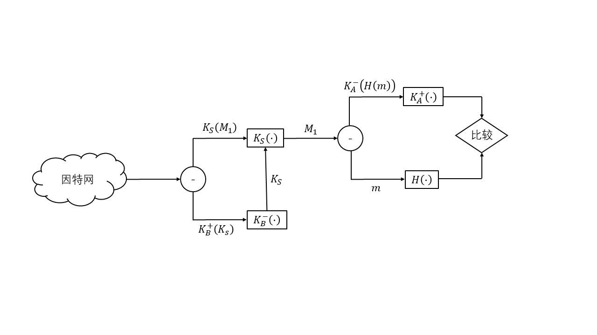
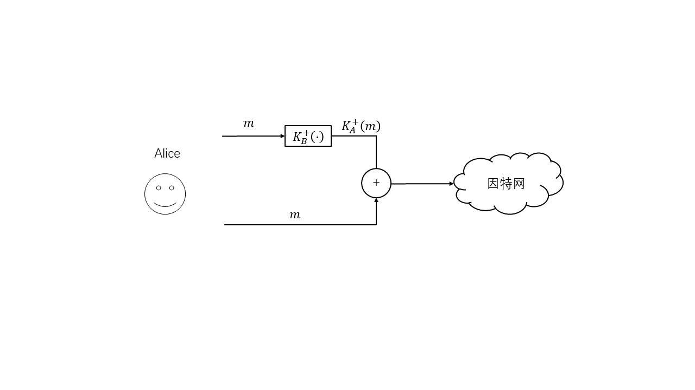
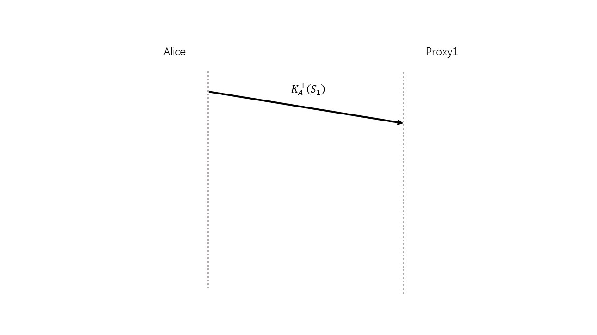
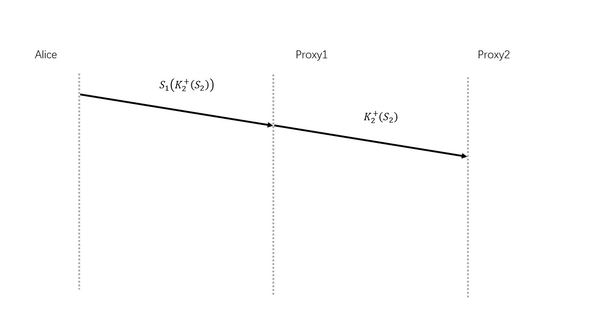
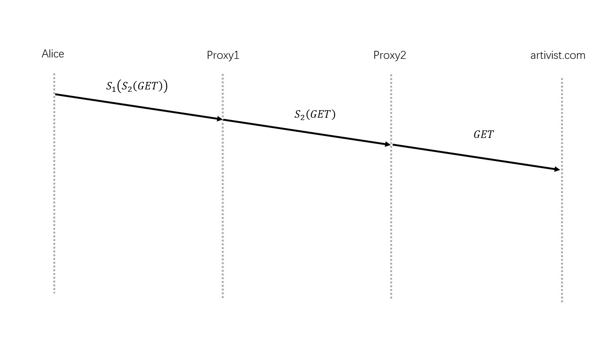

* **P1**  
加密报文： Uasi si mj cmiw lokngch  
解密报文： wasn't that fun  

* **P2**  
26!/(26-7)! = 26 * 25 * 24 * 23 * 22 * 21 * 20 ~= 3.3* 109  

* **P3**  
如果知道使用了多码代替密码，通过报文和对应的铭文编码可以破解出部分规则，尤其是这一句话中包含所有的字母，这样就可以完全破解第一个单码。剩下的规则利用暴力即可破解。  

* **P4**  
a. 00000101重复8次  
b. 00000101重复7次10000101  
c. 情况a：00000101重复8次  
情况b：10100001 10100000重复7次  

* **P5**  
8*28 * 8 =  16384b = 16kb  
全表64比特的密码是 264 * 8 = 267  

* **P6**  
a. 011011011  
b. 推测到报文中3个块是重复的  
c. 100110101  

* **P7**  
a.  
为了（偷懒），选择与标准答案一样的ed  
n = 33 z = 20  
选择e为9，d为9  
dog采用字符顺序，为 4 15 7    

d的加密过程：  
49 = 262,144  
c = 49 mod 33 = 25  
d的解密过程：  
259 = 3,814,697,265,625‬  
m = 259 mod 33 = 4  

o的加密过程：  
159 = 38,443,359,375‬  
c = 159 mod 33 = 3  
o的解密过程：  
39 = 19,683‬  
m = 39 mod 33 = 15  

g的加密过程：  
79 = 40,353,607‬‬  
c = 79 mod 33 = 19  
g的解密过程：  
199 = 322,687,697,779‬‬  
m = 199 mod 33 = 7  

b. 
为了（偷懒），选择与标准答案一样的pqed  
由于有26个字母，因此一个字母需要5b来存贮，三个字母就是15b。  
m = 4 * 32 * 32 + 15 * 32 + 7 = 4,583‬ 
因此选择p = 43 q = 107 n = 4601 z = 4452 e = 61 d = 73  

加密过程：  
4,583‬61 = 21386577601828057804089602156530567188611499869029788733808438804302864595620613956725840720949764845640956118784875246785033236197777129730258961756918400292048632806197527785447791567255101894492820972508185769802881718983  
c = 4,583‬61 mod 4601 = 402  
g的解密过程：  
40273 = 12838133136197716341957121325397932876435331474825362093284052627930271588610123920532872496335709674931222802214538150129342413705402045814598714979387232141014703227794586499817945633390592  
m = 40273 mod 4601 = 4583  

* **P8**  
a. n = 55 z = 40  
b. e和z没有非1公因数  
c. d = 27  
d. 
加密过程：  
83 = 512‬‬  
c = 83 mod 55 = 17  
g的解密过程：  
1727 = 1667711322168688287513535727415473  
m = 1727 mod 55 = 8  

* **P9**  
略。  

* **P10**  
不理解KA-KDC(A,B)的意义，本题略。  

* **P11**  
IOU190.90BOB  

* **P12**  
加密端：在生成MAC之后把报文和MAC一起用对称加密密钥加密。  
解密端：先用对称加密密钥解密，再比较MAC。  

* **P13**  
首先需要保证torrent文件没有被篡改。这使用MAC协议或者数字签名即可。  
然后torrent文件里面包含所有块的散列，比如使用MD5。  
这样用户每收到一个块，就能验证这个块是不是假冒的。  

* **P14**  
OSPF是在一个自治系统内部，一般都是地理上相近的，使用MAC输入鉴别密码相对较方便。  
而数字签名需要一个PKI，结构相对复杂，计算量更高，花费时间较长。  
而OSPF协议经常会使用到，因此选择了MAC。  

* **P15**  
略。  

* **P16**  
a. 略

b 根据标准答案，说无法验证Alice的公钥。  

* **P17**  
英文和中文的题目都错了？应该是图8-21仅提供了Alice要执行的操作。  
   

* **P18**  
a. 如果Alice没有公钥私钥对，那么无法对初始的Alice进行验证。  
b.  
   

* **P19**  
这个题目等完成SSL的wireshark实验再回来做比较好 PS：我做这个题目的时候还没做实验。  
a. 是由客户发送的  
b. 服务器的IP 216.75.194.220 端口号 443  
c. 283  
d. 从图中看有3个  
e. 按照书上的步骤，上一步是服务器发送证书。这一步应该是客户发送加密的前主密钥。  
f. 还未做wireshark实验，直接看标准答案得到：First byte: bc; Last byte: 29  
g. 不清楚  

* **P20**  
可以，只需要调整后续所有的报文段的TCP序号，使得用户接收到的报文段的TCP序号"看起来"是正确的。  

* **P21**  
是不可以的，即使使用重放攻击，也不能通过SSL的序号和不重数验证。  

* **P22**  
a. 否  
b. 是  
c. 是  
d. 否，应该使用新的序号  

* **P23**  
不是。  
如果不改序号，那么通过序号就能识别该报文是重放攻击。  
如果更改序号因为序号字段也是计算MAC一部分，Trudy由于没有MAC密钥，因此无法生成正确的散列，因此无法通过验证。  

* **P24**  
a. 11 01011010 0010  
标准答案的最后四个和我不一样，标准答案错了？  
b. 同样异或即可获得报文和ICV  
c. 翻转第一个或者第5个比特  
d. 假设只把数据第一个比特翻转 整个分组为： 11 11011010 0010  
异或后为： 00100000 1010  
重新计算数据的ICV为： 0010 与报文中的ICV不同，验证失败，报文不完整。  

* **P25**  
连接表  

| 源地址 | 目的地址 | 源端口 | 目的端口 | 
:---: | :---: | :---: | :---: | 
| 222.22.1.1 | 123.234.123.234 | 10000 | 23 | 
| 222.22.1.2 | 123.234.123.235 | 10001 | 23 | 
| 222.22.1.3 | 123.234.123.236 | 10002 | 23 | 

过滤器表  

| 动作 | 源地址 | 目的地址 | 协议 | 源端口 | 目的端口 | 标志比特 | 核对连接 |
:---: | :---: | :---: | :---: | :---: | :---: | :---: | :---: | 
| 允许 | 222.22/16外部 | 222.22.0.12 | HTTP | >1023 | 80 | 任意 |  | 
| 允许 | 222.22.0.12 | 222.22/16外部 | HTTP | 80 | >1023 | 任意 |  | 
| 允许 | 222.22/16内部 | 222.22/16外部 | Telnet | >1023 | 23 | 任意 |  | 
| 允许 | 222.22/16外部 | 222.22/16内部 | Telnet | 23 | >1023 | ACK | X | 
| 拒绝 | 全部 | 全部 | 全部 | 全部 | 全部 | 全部 |  | 

* **P26**  
a.  
   
b.  
   
c.  
   

