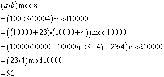

* **R1**  
区别是机密性要求不能被其他人理解报文内容，完整性可以理解报文内容，但是不能被篡改。  
可以有机密性但是没有完整性。  
可以有完整性但是没有机密性。  

* **R2**  
路由器-路由器 交换链路状态信息或者距离向量时，需要安全通信，不能被篡改。  
主机-Web服务器  浏览网页需要安全通信，不能被篡改。  
主机-邮件服务器 发送邮件需要安全通信，保密且不能被篡改。  

* **R3**  
差异是加密和解密使用的密钥是否相同。  

* **R4**  
是已知明文攻击。  

* **R5**  
28种可能的输入块。有28!种可能的映射。  

* **R6**  
使用对称密钥，需要N(N-1)个密钥。  
使用公钥密码，需要N个密钥。  

* **R7**  
   

* **R8**  
87  

* **R9**  
通过报文计算出一个字符串，使得不同报文生成的字符串是不同的。  

* **R10**  
不可能。因为散列函数的设计上是不可逆的。  

* **R11**  
有缺陷  
1. 把s直接暴露在报文中，让窃听者获取了s，不再是秘密。  
2.  丢失了鉴别虚假报文的功能。  

* **R12**  
我们可以证实他是完整的，没有被伪造，修改的，且来源是正常的。  

* **R13**  
公钥直接加密报文计算量太大，耗时太长。而只加密散列计算量不大。  

* **R14**  
错误，应该用certifier.com私钥来加密。  

* **R15**  
基于数字签名的更合适，因为MAC要求Alice和每个人有独立的鉴别密钥。  

* **R16**  
防止回放攻击。  

* **R17**  
是很长的一段时间，至少不能是一次TCP连接的时间。  
标准答案：一生只用一次。  

* **R18**  
在HMAC后面附加上，使用类似端点鉴别中的不重数。  

* **R19**  
Bob使用Alice的公钥验证签名，得到散列值，再与报文内容得到的散列值相比较，如果一致，就能验证Alice生成了这个报文。  
PGP没有使用MAC，使用了数字签名验证完整性。  

* **R20**  
错误，序号只用来计算MAC，不包含在报文内。  

* **R21**  
目的是防御“连接重放”攻击。  

* **R22**  
错误的，因为IV是从MS获得的，MS是从PMS获得的，而PMS是客户生成，用公钥加密后发送给服务器的。  

* **R23**  
在3步，发送给Trudy后，服务器无法解密PMS。此时Bob还没有发现。  
在4步，Trudy无法生成各种密钥。  
在6步，Trudy无法发送正确的MAC，因此被Bob发现。  

* **R24**  
错误。如果A到B，那么最多两个SA。  

* **R25**  
错误，因为这是一个新分组，对于IPsec来说并不清楚是否是重传，也没必要知道。  

* **R26**  
不是。IKE SA是用来生成IPsec SA的信道。  

* **R27**  
01011100  

* **R28**  
正确。  

* **R29**  
连接表：  
追踪所有进行中的TCP连接。  
访问控制列表：  
实现防火墙规则。  

* **R30**  
正确的。  

* **R31**  
正确。  

* **R32**  
应用程序网关可以在应用层判断连接，而分组过滤器是在网络层和传输层判断。  
标准答案：  
如果没有数据包过滤器，那么该机构网络内的用户仍然可以直接连接到该机构网络外的主机。过滤器强制用户首先连接到应用程序网关。  

* **R33**  
不一定需要检查载荷，与规则集指定的规则有关。  
