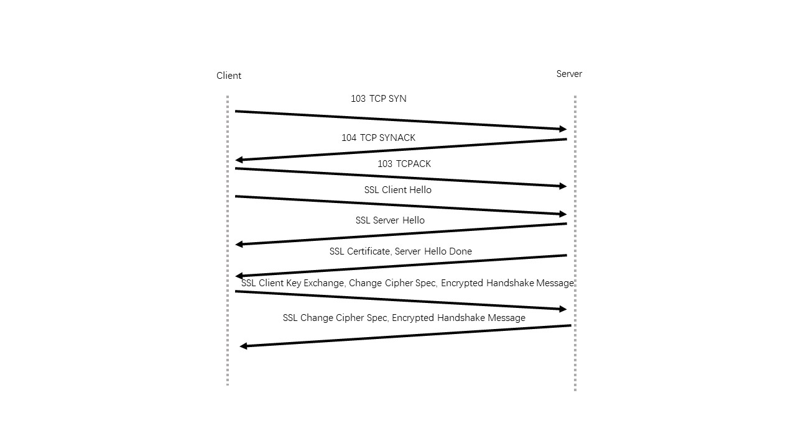

### Wireshark_SSL  
英文版的标题都写错了，没想到如此不细心。  
试了很多HTTPS的网站，都采用TLS加密，因此我们采用网站上作者给出的抓包结果。  

1.  
| 编号 | 来源 | SSL记录数量 | SSL记录类型 | 
:---: | :---: | :---: | :---: | 
| 103 | 客户到服务器 | 0 | \ | 
| 104 | 服务器到客户 | 0 | \ | 
| 105 | 客户到服务器 | 0 | \ | 
| 106 | 客户到服务器 | 1 | Client Hello | 
| 108 | 服务器到客户 | 1 | Server Hello | 
| 111 | 服务器到客户 | 2 | Certificate, Server Hello Done | 
| 112 | 客户到服务器 | 3 | Client Key Exchange, Change Cipher Spec, Encrypted Handshake Message | 
| 113 | 服务器到客户 | 3 | Change Cipher Spec, Encrypted Handshake Message | 

 

2. 
| 字段 | 长度 | 
:---: | :---: |
| Content Type | 1B | 
| Version | 2B | 
| Length | 2B | 

3. 22  

4. 42dbf0c21b781c6c644b84fe4efa7be6ef21efc98e350355e90695001e79031c  

5.  
非对称密钥加密算法：RSA  
对称密钥加密算法：RC4,DES,RC2  
哈希算法：MD5,SHA,CBC  

6. 是的，包含RSA, RC4, MD5  

7. 有，32字节长，用来防止“接连重放”攻击。  

8. 包含，32字节长。  
查询网络，作用是：如果SSL连接断开，再次连接时，可以使用该属性重新建立连接，在双方都有缓存的情况下可以省略握手的步骤。  

9. 证书在单独的记录中，证书太长，不适合单独的以太网帧传输。  

10. 包含前主密钥，是加密的。长度为128。  

11. 指示后面发送的消息都是加密过的。1字节  

12.  Encrypted Handshake Message  

13. 发送了，没有不同  

14. 使用上面协商的加密方法进行加密。应用中没有区分加密的应用程序数据和消息认证码MAC，因此我看不出来。  

15. 第二次连接时，没有发送Client Key Exchange，可能是Seeeion ID的效果。  
